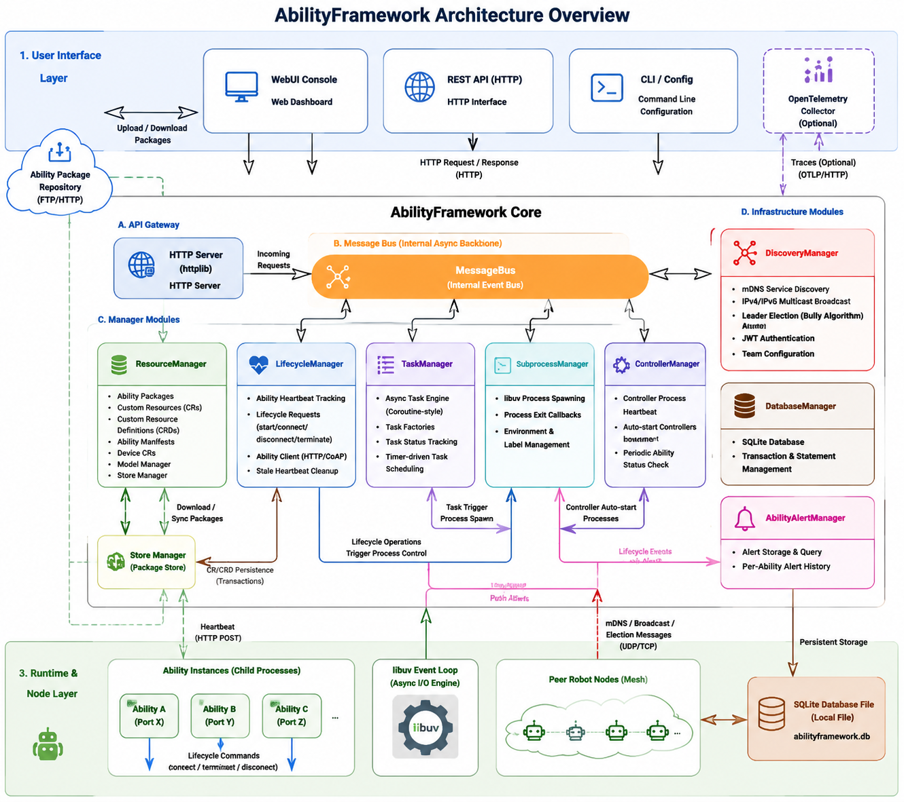

<div align="center">

# AbilityFramework

**An event-driven ability-management framework for deploying, running, and monitoring ability packages on robot nodes.**

[](https://en.cppreference.com/w/cpp/20)
[](https://xmake.io/)
[](#license)

**English** | [中文](README_zh.md)

</div>

AbilityFramework exposes an HTTP REST API and an embedded WebUI console. It coordinates ability resource management, an async task engine, heartbeat-driven lifecycle control, mesh discovery, and more — all from a single self-contained binary.

---

## How It Works

### Architecture

<div  align="center">

</div>

### Workflow

The end-to-end lifecycle of an ability package spans five phases — schema definition, project generation, implementation and packaging, deployment, and MCP invocation. See the flowchart and the step-by-step walkthrough in [First Project](website/docs/en/getting-started/first-project.md).

## Features

- **Resource Management** — Manages ability packages, ability/device Custom Resources (CR/CRD), model info, and storage.
- **Task Engine** — Factory-based async task execution with status tracking.
- **Lifecycle Management** — Heartbeat monitoring and lifecycle state maintenance for ability instances.
- **Mesh Discovery** — IPv4/IPv6 multicast with JWT-based team authentication.
- **Controller Management** — Monitors controller processes and periodically checks ability availability.
- **Subprocess Management** — libuv event-loop based process creation and lifecycle control.
- **Alert Management** — SQLite-backed ability alert recording and querying.
- **Message Bus** — Inter-module message communication.
- **Embedded WebUI Console** — Built into the binary; provides framework debugging, ability inspection, lifecycle operations, and task invocation.

## Getting Started

### Download from Release

Go to the project [Releases](/insight-os/AbilityFramework/-/releases) page and download the prebuilt binary for your platform.

### Build from Source

**Prerequisites**

- A C++20 compiler (with coroutine support)
- [xmake](https://xmake.io/) build tool
- Python 3 (the WebUI is embedded at build time)

```sh
xmake config -m release
xmake build
```

The build automatically:

- Generates `include/version.hpp` from `include/util/version.hpp.in` (build date + git commit hash)
- Generates `src/webui_embedded.cpp` from the `webui/` directory (embeds the frontend into the binary)

#### Build Options

| Option | Default | Description |
| -------- | --------- | ------------- |
| `--fwk-static` | false | Statically link all libraries; used for cross-compilation |
| `--use-cpptrace` | false | Enable cpptrace for framework debugging |
| `--enable-test` | false | Enable unit tests (requires doctest) |

Example — build and run the test suite:

```sh
xmake config -m debug --enable-test
xmake build test
xmake run test
```

## Quick Start

```sh
# Export the default config
./AbilityFramework -o config.yaml

# Launch the framework
export ABILITY_FRAMEWORK_HOME=$(pwd)
./AbilityFramework -c config.yaml

# Open the management console
# Visit http://localhost:8080/ui in your browser
```

For the full list of command-line options and configuration fields (basic + optional), see [Configuration](docs/configuration.md).

## WebUI Console

The framework embeds a WebUI. After launch, visit `http://<host>:<port>/ui` — no separate frontend deployment needed.

| Section | Features |
| --------- | ---------- |
| **Framework Debug** | Status checks, config view, CRD/package lists, CR files, alert records, mesh info, package upload |
| **Ability Inspection** | Ability/device/service instance lists, real-time status, instance details, deletion |
| **Lifecycle** | Real-time heartbeat monitoring (auto-refresh), lifecycle command dispatch, CR creation |
| **Task Invocation** | Select a running ability, view registered tasks, execute a task, query results |

WebUI behavior is controlled by the `webui` config:

| Config | Effect |
| -------- | -------- |
| `webui.enabled: true` (default) | Enable the embedded WebUI |
| `webui.enabled: false` | Disable the WebUI |
| `webui.custom_path: /path` | Use external frontend files instead of the embedded version (for development/debugging) |

## Working Directory

The framework determines its working directory from the `ABILITY_FRAMEWORK_HOME` environment variable, defaulting to the current directory if unset. On startup it creates this structure:

```
ABILITY_FRAMEWORK_HOME/
├── config.yaml                          # config file
├── packages/                            # ability packages
│   └── <package_name>/
│       └── <version>/                   # version must follow semver
│           ├── package.yaml             # package manifest (required)
│           ├── ability.manifest.yaml    # ability manifest (required)
│           └── bin/
│               └── ability              # executable
├── crs/                                 # CR instance definition files (YAML); scanned periodically
├── databases/                           # SQLite database (ability_framework.db)
└── log/                                 # log files
```

`package.yaml` manifest format:

```yaml
name: my.ability.org       # package name
version: 1.0.0             # semantic version
arch: x86_64               # target architecture (must match the host)
```

`ability.manifest.yaml` is the ability manifest describing the ability's interface, schema, dependencies, etc. CRDs are built into the framework; ability packages only need to carry the manifest.

**CR auto-loading:** The framework scans the `crs/` directory every `resource_mgr.update_interval` seconds and auto-loads any YAML files within it. Instances with `spec.autoStart: true` are started automatically.

## Documentation

Detailed reference material lives under `docs/`:

- [Configuration](docs/configuration.md) — command-line options and the full configuration file reference
- [REST API](docs/rest-api.md) — ability instance lifecycle via the HTTP API (upload, create, start, stop, delete)
- [Roadmap](docs/roadmap.md) — quarterly evolution Gantt chart with per-quarter feature breakdown

## Roadmap

These directions are in active development and may shift as the design matures.

See the full quarterly roadmap (with Gantt chart and per-quarter feature breakdown) at [Roadmap](docs/roadmap.md).

## License

This project is licensed under the [Apache License 2.0](LICENSE).
