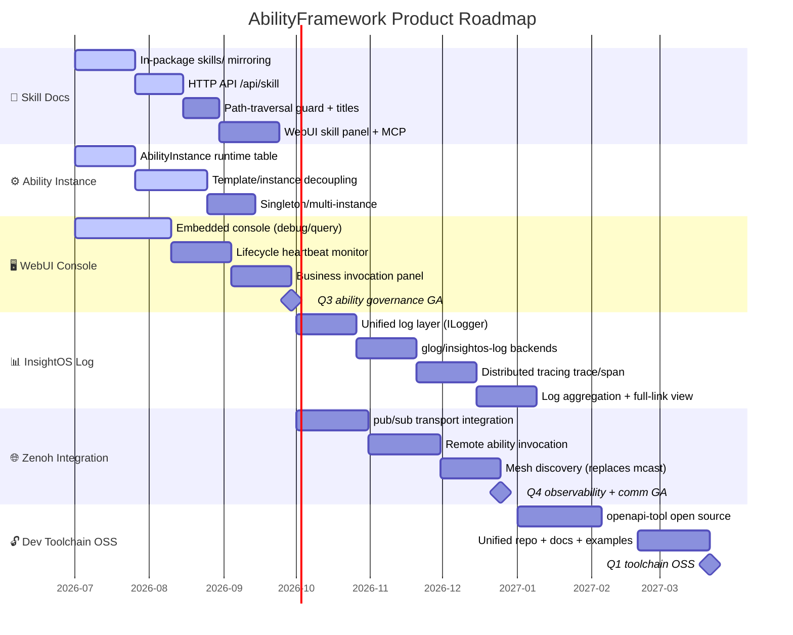

# Roadmap

AbilityFramework evolution from 2026 Q3 to 2027 Q1. Details may shift as the design matures.

## 2026 Q3 · Ability Governance & Runtime Model

This quarter makes "how an ability package is governed, how it is invoked by an LLM, and how it is visualized in the console" first-class concerns of the framework.

### 🧩 Skill Docs

Ability packages can carry skill documentation aimed at AI Agents. At install time the framework mirrors it to a fixed location and exposes it via HTTP API to the WebUI, MCP Server, and upstream Agents. It solves the core problem that packages could previously only describe their **runtime model** (CR/CRD), not **how to be invoked by an LLM**.

| Aspect | Detail |
| --- | --- |
| In-package asset | `skills/` subdirectory inside a package; any extension, any directory depth |
| Mirroring | Three idempotent triggers: `extract_package` (upload) / `add_package` (online install) / `update` (startup + periodic backfill) |
| Mirror layout | `skills/_packages/<pkg>/<version>/`, machine-enumerable |
| HTTP API | `GET /api/skill` (list metadata), `GET /api/skill/:pkg/:ver/:file` (read content) |
| Security | `read_skill` uses `weakly_canonical` for path-traversal protection; canonical path must stay strictly inside the mirror directory |
| Title extraction | `extract_skill_title`: body `#` heading > frontmatter `title:` > `name:` > empty |
| Position | Pure file asset — no DB, no reconcile, lifecycle fully bound to the package |
| Consumers | WebUI skill panel (human), MCP Server (converts to tool definitions), Agent (invocation decisions) |

### ⚙️ Ability Instance

Decouples the ability template (CR) from the running process: the template is a static declaration; the instance is a runtime object derived from the template at a given moment, with its own `instance_id`, destroyed on exit. CR templates are like classes; ability instances are like objects.

| Aspect | Detail |
| --- | --- |
| Data model | New `AbilityInstance` runtime table, N:1 decoupled from the `AbilityCRBasic` template table |
| instance_id | Runtime instance UUID generated by `create_ability_instance`, **different from the template `cr_id`** |
| Config freeze | Writes `spec_snapshot` at creation to prevent config drift when the template is later changed |
| Concurrent instances | Singleton (`singleton: 1`) / multi-instance (`singleton: 0`), supports multiple concurrent replicas of the same ability |
| Lifecycle | Instance row is deleted immediately on exit, no history retained |
| Creation path | `POST /api/instance` → `create_ability_instance` → write instance table → `lifecycle_request start` → spawn child process |

### 🖥️ WebUI Console

A management console embedded in the binary. Access `http://<host>:<port>/ui` after startup — no separate frontend deployment needed.

| Panel | Function |
| --- | --- |
| Framework debug | Status checks, config view, CRD/package list, CR files, alert records, mesh info, package upload |
| Ability query | Ability/device/service instance list, real-time status, instance details, delete |
| Lifecycle | Real-time heartbeat monitoring (auto-refresh), lifecycle commands, create CR |
| Business invocation | Select a running ability, view registered tasks, run task, query results |
| Skill docs | Skill-document panel (new in Q3), list metadata + read content |

## 2026 Q4 · Observability & Distributed Communication

This quarter fills two gaps: unified observability makes ability execution fully visible, and Zenoh enables cross-node scheduling.

### 📊 InsightOS Log (Observability)

Unified observability covering structured logging, distributed tracing, and log aggregation, for end-to-end visibility into ability execution.

| Aspect | Detail |
| --- | --- |
| Unified log layer | Strategy pattern + singleton manager: one `ILogger` interface, two implementations, mutually exclusive config |
| Backends | `glog` (process-level text logger) / `insightos-log` (structured logging SDK), pick one |
| Call styles | fmt format macros (recommended for new code) / streaming `LOG(INFO)<<` (legacy compat) / `CHECK` assertions |
| Distributed tracing | `trace_id` / `span_id`, `StartNewTrace` / `ContinueTrace` / `GenerateSpanID` |
| HTTP middleware | `pre_routing` injects trace context, `post_routing` returns `X-InsightOSLog-TraceID` / `SpanID` |
| Log aggregation | Structured logs + full-link correlation; all logs for a single request form a call-chain view |
| Dynamic control | `--verbose-log N` adjusts VLOG and backend min level; `--log-to-stdout` forces console output |
| Glog backend behavior | All tracing methods are no-ops when the backend is glog; callers need not branch on backend type |

### 🌐 Zenoh Integration (Distributed Communication)

Adopt [Eclipse Zenoh](https://zenoh.io/) as an additional pub/sub transport for cross-node messaging, remote ability invocation, and mesh discovery — a low-overhead alternative to the current multicast + HTTP path.

| Aspect | Detail |
| --- | --- |
| Transport | Zenoh pub/sub, low-overhead cross-node messaging |
| Remote ability invocation | Start and invoke ability processes across nodes |
| Mesh discovery | Replaces the current "multicast + HTTP" discovery scheme |
| Remote execution | With `use_remote_execution: true`, `POST /api/instance` skips local manifest lookup and package download; the ability process starts on a remote node |
| Control / execution plane | Local framework is the control plane; remote nodes are the execution plane |
| State maintenance | The local framework only sends `lifecycle_request` and maintains heartbeat state |

## 2027 Q1 · Developer Ecosystem & Open Source

The main theme this quarter is **open-sourcing the ability development tools**, handing the full "define interface → generate CR → SDK implementation" toolchain to the community to lower the barrier for ability development and integration.

| Tool | Language | Purpose |
| --- | --- | --- |
| openapi-tool | — | Generates CR files conforming to the ability spec from OpenAPI definitions (`generate-crd-from-openapi.py`), supporting `x-insightos` / `x-ability-config` / `x-tasks` / `x-depends` extensions |

After open-sourcing, community developers can: describe an ability interface in OpenAPI → auto-generate a CR with the tool → implement ability logic with the Python / C++ SDK → package it and deploy to the framework, then let Agents auto-discover and invoke it via Skill docs.

## Cross-Quarter Dependencies

- Q4's **InsightOS Log** tracing context is injected into the ability call chain established in Q3, making instance creation, heartbeat, and business invocation fully observable.
- Q4's **Zenoh remote execution** reuses Q3's ability-instance model: remotely spawned processes are managed with the same `instance_id` and report heartbeat state back, only the execution plane is on a remote node.
- The **CR** and **Skill docs** produced by the Q1 open-source toolchain are exactly the inputs to Q3's runtime model and Agent invocation, closing the "develop → deploy → invoke" loop.
