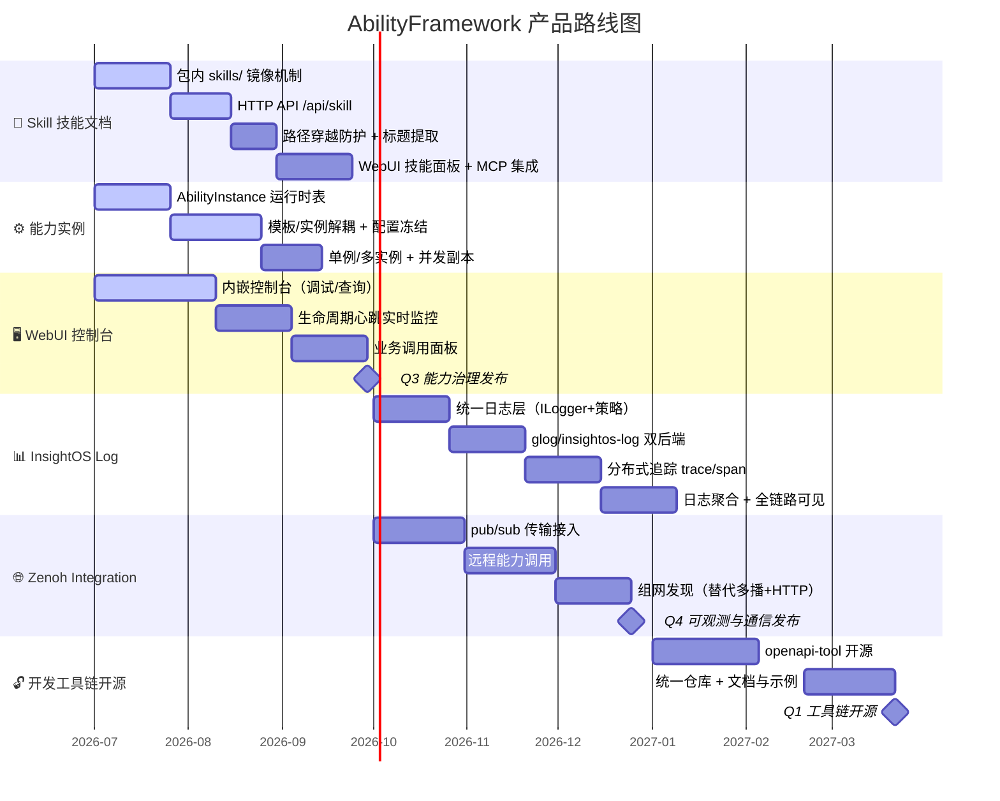

# 路线图

AbilityFramework 从 2026 Q3 到 2027 Q1 的演进方向。具体细节可能随设计演进而调整。

## 2026 Q3 · 能力治理与运行时模型

这一季度的主线是把「能力包如何被治理、如何被 LLM 调用、如何在控制台可视化」三件事变成框架一等公民。

### 🧩 Skill 技能文档

让能力包可以携带面向 AI Agent 的技能说明文档，安装时被框架镜像到固定位置，再通过 HTTP API 暴露给 WebUI、MCP Server 与上层 Agent。它解决的核心问题是：能力包此前只能描述**运行时模型**（CR/CRD），却无法描述**如何被 LLM 调用**。

| 维度 | 说明 |
| --- | --- |
| 包内资产 | 能力包 `skills/` 子目录，任意扩展名、任意目录深度 |
| 镜像机制 | 三处触发点幂等镜像：`extract_package`（上传）/ `add_package`（在线安装）/ `update`（启动 + 定时兜底） |
| 镜像目录 | `skills/_packages/<包名>/<版本>/`，机器可枚举 |
| HTTP API | `GET /api/skill`（列元数据）、`GET /api/skill/:pkg/:ver/:file`（读原文） |
| 安全 | `read_skill` 用 `weakly_canonical` 做路径穿越防护，规范路径必须严格落在镜像目录内 |
| 标题提取 | `extract_skill_title`：正文 `#` 标题 > frontmatter `title:` > `name:` > 空 |
| 定位 | 纯文件资产，不进 DB、不参与 reconcile，生命周期完全跟随包 |
| 消费者 | WebUI 技能文档面板（人工）、MCP Server（转 tool 定义）、Agent（决策调用） |

### ⚙️ 能力实例

把「能力模板（CR）」和「正在跑的进程」解耦：模板是静态声明，实例是模板在某时刻派生出的、拥有独立 `instance_id` 的运行时对象，退出即销毁。CR 模板像类（class），能力实例像对象（object）。

| 维度 | 说明 |
| --- | --- |
| 数据模型 | 新增 `AbilityInstance` 运行时表，与 `AbilityCRBasic` 模板表 N:1 解耦 |
| instance_id | 运行时实例 UUID，由 `create_ability_instance` 生成，**与模板 `cr_id` 不同** |
| 配置冻结 | 创建瞬间写入 `spec_snapshot`，避免模板被改后正在运行的实例配置漂移 |
| 并发实例 | 单例（`singleton: 1`）/ 多实例（`singleton: 0`），支持同一能力的多个并发副本 |
| 生命周期 | 实例退出后行立即删除，不保留历史 |
| 创建链路 | `POST /api/instance` → `create_ability_instance` → 写实例表 → `lifecycle_request start` → 拉起子进程 |

### 🖥️ WebUI 管理控制台

内嵌于二进制的管理控制台，启动后访问 `http://<host>:<port>/ui` 即可使用，无需额外部署前端文件。

| 区块 | 功能 |
| --- | --- |
| 框架调试 | 状态检查、配置查看、CRD/包列表、CR 文件、告警记录、组网信息、能力包上传 |
| 能力查询 | 能力/设备/服务实例列表、实时状态、实例详情、删除操作 |
| 生命周期 | 心跳实时监控（自动刷新）、生命周期命令发送、创建 CR |
| 业务调用 | 选择运行中的能力、查看已注册 task、执行 task、查询结果 |
| 技能文档 | 技能文档面板（Q3 新增），列元数据 + 读原文 |

## 2026 Q4 · 可观测性与分布式通信

这一季度补齐「看得见」和「跨得过去」两块能力：统一可观测性让能力执行全链路可见，Zenoh 让能力可以跨节点调度。

### 📊 InsightOS Log（可观测性）

统一可观测性能力，覆盖结构化日志、分布式追踪以及日志聚合，实现能力执行全链路可见。

| 维度 | 说明 |
| --- | --- |
| 统一日志层 | 策略模式 + 单例管理器：一个 `ILogger` 接口、两个实现、互斥配置 |
| 后端 | `glog`（进程级文本日志）/ `insightos-log`（结构化日志 SDK），二选一 |
| 调用风格 | fmt 格式化宏（推荐新代码）/ 流式 `LOG(INFO)<<`（兼容旧代码）/ `CHECK` 断言 |
| 分布式追踪 | `trace_id` / `span_id`，`StartNewTrace` / `ContinueTrace` / `GenerateSpanID` |
| HTTP 中间件 | `pre_routing` 注入链路、`post_routing` 回传 `X-InsightOSLog-TraceID` / `SpanID` |
| 日志聚合 | 结构化日志 + 全链路串联，同一次请求的全部日志可形成调用链视图 |
| 动态控制 | `--verbose-log N` 调节 VLOG 与后端最小级别；`--log-to-stdout` 强制控制台输出 |
| Glog 后端行为 | tracing 相关方法在后端为 glog 时均为空操作，调用方无需判断后端类型 |

### 🌐 Zenoh Integration（分布式通信）

引入 [Eclipse Zenoh](https://zenoh.io/) 作为新增的 pub/sub 通信传输，用于跨节点消息通信、远程能力调用与组网发现，作为现有「多播 + HTTP」方案的低开销替代。

| 维度 | 说明 |
| --- | --- |
| 通信传输 | Zenoh pub/sub，低开销跨节点消息通信 |
| 远程能力调用 | 跨节点远程启动与调用能力进程 |
| 组网发现 | 替代现有「多播 + HTTP」组网方案 |
| 远程执行 | `use_remote_execution: true` 时，`POST /api/instance` 跳过本地 manifest 查找与包下载，能力进程在远端节点启动 |
| 控制面 / 执行面 | 本地框架作为控制面，远端节点作为执行面 |
| 状态维护 | 本地框架只负责发送 `lifecycle_request` 和维护心跳状态 |

## 2027 Q1 · 开发者生态与开源

这一季度的主线是**能力开发工具源码开源**，把能力从「定义接口 → 生成 CR → SDK 实现」的完整工具链交给社区，降低能力开发与集成门槛。

| 工具 | 语言 | 作用 |
| --- | --- | --- |
| openapi-tool | — | 从 OpenAPI 定义生成符合能力规范的 CR 文件（`generate-crd-from-openapi.py`），支持 `x-insightos` / `x-ability-config` / `x-tasks` / `x-depends` 等扩展 |

开源后社区开发者可以：用 OpenAPI 描述能力接口 → 工具自动生成 CR → 用 Python / C++ SDK 实现能力逻辑 → 打包成能力包部署到框架，并通过 Skill 文档让 Agent 自动发现与调用。

## 跨季度依赖关系

- Q4 的 **InsightOS Log** 追踪上下文会注入 Q3 建立的能力调用链，让实例的创建、心跳、业务调用全链路可观测。
- Q4 的 **Zenoh 远程执行**复用 Q3 的能力实例模型：远程拉起的进程同样以 `instance_id` 管理、心跳状态回传，只是执行面在远端节点。
- Q1 开源的工具链生成的 **CR** 与 **Skill 文档**，正是 Q3 运行时模型与 Agent 调用的输入，形成「开发 → 部署 → 调用」闭环。
