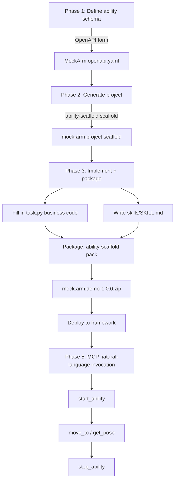

# First Project

Build a robotic-arm control ability from scratch — **define, generate, implement, package** — and connect it to MCP for natural-language invocation.

## Project creation workflow



## Phase 1 — Define the ability schema with a form

### 1.1 Start the OpenAPI form

```bash
chmod +x openapi-tool-v1.0.0-linux-x86_64
./openapi-tool-v1.0.0-linux-x86_64 serve --port 5000
```

Open `http://localhost:5000/form` in a browser.

### 1.2 Fill in the ability information

Enter the following in the form (using the mock arm as an example):

**Basic information**:

| Field | Value |
|------|------|
| Ability name (title) | `MockArm.Demo` |
| Version (version) | `1.0.0` |
| Description | Mock robotic-arm control demo ability |

**InsightOS extensions**:

| Field | Value |
|------|------|
| Package name (packageName) | `mock.arm.demo` |
| Resource type (kind) | `AtomAbility` |

**CR options**:

| Field | Value |
|------|------|
| Singleton mode (singleton) | unchecked (false) |
| Auto start (autoStart) | unchecked (false) |

**Tasks** — add two tasks:

| taskType | taskName | summary |
|----------|----------|---------|
| 0 | MoveTo | Move to the target position |
| 1 | GetPose | Get the current pose |

**MoveTo parameters**:

- `x` (number, required, target X coordinate in meters)
- `y` (number, required, target Y coordinate in meters)
- `z` (number, required, target Z coordinate in meters)
- `speed` (number, optional, speed scale 0~1)

**MoveTo returns**:

- `success` (boolean, whether the target was reached)
- `error_distance` (number, error distance in meters)

**GetPose parameters**: none

**GetPose returns**:

- `x` (number)
- `y` (number)
- `z` (number)

### 1.3 Export

1. Click the **"OpenAPI YAML"** tab → the **"Download OpenAPI"** button, and save it as `MockArm.openapi.yaml`
2. Click the **"Manifest + CR"** tab and verify that the generated `ability.manifest.yaml` and `ability.cr.yaml` previews are correct

Place `MockArm.openapi.yaml` in this directory:

```bash
mv ~/Downloads/MockArm.openapi.yaml .
```

Press `Ctrl+C` to stop openapi-tool.

## Phase 2 — Generate the project from OpenAPI

```bash
ability-scaffold scaffold --openapi MockArm.openapi.yaml -o ./mock-arm
```

Inspect the generated project:

```
mock-arm/
├── main.py                    # entry point
├── task.py                    # task implementation skeleton (TODO: fill in)
├── ability.cr.yaml            # CR declaration
├── ability.manifest.yaml      # ability manifest
├── requirements.txt           # dependencies (ability-py>=0.3.0, flask, ...)
└── service/
    ├── __init__.py            # imports from ability_py
    └── ability.py             # lifecycle callbacks
```

## Phase 3 — Implement business code + write the Skill + package

### 3.1 Implement task.py

Open `mock-arm/task.py` and fill in the `execute()` methods. Using a mock implementation as an example:

```python
from ability_py import TaskInterface
import time
import random


class MoveToTask(TaskInterface):
    """Move to the target position (taskType: 0)"""

    def execute(self, input_data: dict) -> dict:
        x = input_data.get("x", 0.0)
        y = input_data.get("y", 0.0)
        z = input_data.get("z", 0.0)
        speed = input_data.get("speed", 0.3)

        # mock: simulate motion delay
        duration = max(0.5, 2.0 * (1 - speed))
        time.sleep(duration)

        # mock: add a small random error
        error = random.uniform(0.0001, 0.003)
        return {
            "success": True,
            "error_distance": round(error, 4),
        }


class GetPoseTask(TaskInterface):
    """Get the current pose (taskType: 1)"""

    def execute(self, input_data: dict) -> dict:
        return {
            "x": round(random.uniform(-0.5, 0.5), 4),
            "y": round(random.uniform(-0.3, 0.3), 4),
            "z": round(random.uniform(0.0, 0.6), 4),
        }
```

### 3.2 (Optional) Adjust service/ability.py

If you need to initialize on startup (e.g. connect to a real device), edit the `on_start()` and `on_terminate()` methods in `mock-arm/service/ability.py`. For a mock demo, the generated default code is already usable.

### 3.3 Write the Skill document

Create `skills/SKILL.md` under `mock-arm/` to provide usage knowledge to the MCP agent:

```bash
mkdir -p mock-arm/skills
```

Write `mock-arm/skills/SKILL.md`:

```markdown
---
name: mock-arm-control
description: Control a mock robot arm. Use when the user asks to move
             the arm, check position, or do pick-and-place tasks.
---

# Mock Arm Control

## When to use

Trigger this skill when the user mentions:
- moving a robot arm / end-effector
- checking arm position / pose
- pick and place operations

## Canonical workflow

1. `start_ability(template="mockarm-demo-1")`
2. Execute task(s):
   - `mock_arm_demo__move_to(x=0.3, y=0.1, z=0.2, speed=0.5)`
   - `mock_arm_demo__get_pose()`
3. `stop_ability(target="mockarm-demo-1")`

## Tools

### move_to
Move arm to target position.
- **x** (number, required): X coordinate in meters
- **y** (number, required): Y coordinate in meters
- **z** (number, required): Z coordinate in meters
- **speed** (number, optional): Speed scale 0.0~1.0, default 0.3

Returns: `{success: bool, error_distance: number}`

### get_pose
Get current arm position. No parameters.

Returns: `{x: number, y: number, z: number}`

## Gotchas
- Coordinates are in meters, base_link frame
- speed=1.0 is maximum, not recommended for precision tasks
- Always start_ability before calling tasks
```

### 3.4 Add the packaging requirements

```bash
cd mock-arm

# 1. package.yaml
cat > package.yaml << 'EOF'
name: mock.arm.demo
version: 1.0.0
arch: x86_64
EOF

# 2. bin/ability launcher script
mkdir -p bin
cat > bin/ability << 'LAUNCHER'
#!/bin/bash
SCRIPT_DIR="$(cd "$(dirname "$0")/.." && pwd)"
exec python3 "$SCRIPT_DIR/main.py" "$@"
LAUNCHER
chmod +x bin/ability

# 3. Move the CR into crs/ (pack.py excludes the root ability.cr.yaml)
mkdir -p crs
mv ability.cr.yaml crs/mockarm-demo-1.cr.yaml

cd ..
```

### 3.5 Package

```bash
ability-scaffold pack ./mock-arm -o mock.arm.demo-1.0.0.zip
```

Output is similar to:

```
Packaging project: ./mock-arm
  Package name: mock.arm.demo
  Version: 1.0.0
  Arch: x86_64

Package generated: mock.arm.demo-1.0.0.zip (xx KB)
```

After packaging, follow the [Quick start](./quick-start) to deploy the package to the framework.

## Phase 5 — Invoke the ability via MCP + OpenClaw in natural language

[Quick start](./quick-start) verified the full HTTP API chain for invoking an ability. This phase connects an MCP Server so that an AI agent (such as OpenClaw / Claude Code) can control your ability through natural language.

### 5.1 Unzip and install the MCP Server

```bash
unzip ability-mcp-server.zip
cd ability-mcp-server
python3 -m venv .venv
source .venv/bin/activate
pip install -e .
cd ..
```

Verify the installation:

```bash
ability-mcp-server/.venv/bin/python -m ability_mcp.native --help
```

### 5.2 Register the MCP Server in OpenClaw

In the working directory where you run OpenClaw, create or edit `.mcp.json`:

```json
{
  "mcpServers": {
    "ability-framework": {
      "command": "/absolute/path/to/mcp-playground/ability-mcp-server/.venv/bin/python",
      "args": [
        "-m", "ability_mcp.native",
        "--framework-url", "http://localhost:8080"
      ]
    }
  }
}
```

> **Note**: `command` must be an **absolute path** pointing to the Python inside the MCP Server venv.
> `--framework-url` points to the AbilityFramework address started in [Quick start](./quick-start).

Claude Code users use the same `.mcp.json` format, placed in the project root or `~/.claude.json`.

### 5.3 Ensure the framework and ability are ready

```bash
# Make sure the framework is still running (restart it if stopped)
cd framework
./AbilityFramework &
cd ..

# Confirm the ability package is loaded
curl -s http://localhost:8080/api/cr | python3 -c "
import sys, json
for c in json.load(sys.stdin):
    print(f'  {c[\"metadata\"][\"name\"]} -> {c[\"spec\"][\"abilityName\"]}')
"
# You should see: mockarm-demo-1 -> MockArm.Demo
```

### 5.4 Start OpenClaw and control the ability in natural language

Start OpenClaw in the directory that has the `.mcp.json` configured:

```bash
openclaw    # or claude (if you use Claude Code)
```

The MCP Server is launched automatically by OpenClaw. The agent now has the following MCP tools:

| Tool | Purpose |
|------|------|
| `refresh_tools()` | Re-pull the manifest from the framework and update dynamic task tools |
| `start_ability(template="mockarm-demo-1")` | Start an ability instance |
| `stop_ability(target="mockarm-demo-1")` | Stop an ability instance |
| `mock_arm_demo__move_to(x, y, z, speed)` | Invoke the MoveTo task |
| `mock_arm_demo__get_pose()` | Invoke the GetPose task |
| `list_skills()` / `read_skill(uri)` | List/read Skill documents |

### 5.5 Natural-language invocation example

In an OpenClaw / Claude Code session, enter:

```
Please move the arm to position x=0.3, y=0.1, z=0.2 at speed 0.5
```

The agent runs automatically:

1. `start_ability(template="mockarm-demo-1")` — start an ability instance
2. `mock_arm_demo__move_to(x=0.3, y=0.1, z=0.2, speed=0.5)` — invoke MoveTo
3. Returns: `{success: true, error_distance: 0.002}`

Continue the conversation:

```
Now tell me where the arm is
```

The agent runs:

- `mock_arm_demo__get_pose()` → `{x: 0.29, y: 0.10, z: 0.20}`

```
OK, shut down the arm
```

The agent runs:

- `stop_ability(target="mockarm-demo-1")` — stop the instance

### 5.6 How the Skill document takes effect

The `skills/SKILL.md` written in Phase 3 is mirrored by the framework to `skills/_packages/` after the package is uploaded. The MCP Server reads it via the `/api/skill` endpoint and uses it as the agent's prior knowledge:

- The agent discovers available skills via `list_skills()`
- It reads the full content via `read_skill(uri="skill://mock.arm.demo/1.0.0/SKILL.md")`
- The "When to use" + "Canonical workflow" in the Skill guide the agent to choose the correct tool sequence

This is why the agent knows to `start_ability` first, then call the task, and finally `stop_ability` — this three-step workflow is written in the Skill document.
