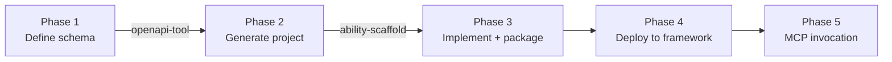

# Full Ability Development Workflow

Walk through the complete workflow of a robotic-arm control ability end to end: **define, generate, implement, package, deploy, and invoke from natural language**.

## Overview



## Tutorial structure

This tutorial is split into the following steps, recommended in order:

1. [Installation](./installation) — clone the project, set up the Python environment and SDK
2. [Quick start](./quick-start) — start the framework, upload an ability package, invoke a task
3. [Configuration reference](./configuration) — minimal fields of the framework `config.yaml`
4. [First project](./first-project) — build a complete ability from scratch and connect it to MCP for natural-language invocation

## Prerequisites

- Linux x86_64 (Ubuntu 20.04+)
- Python 3.8+ (uv recommended for managing virtual environments)
- git-lfs (`sudo apt install git-lfs`)

## Repository contents

```
mcp-playground/
├── AbilityFramework                        # Framework binary v2.5.0 (statically linked, ready to run)
├── openapi-tool-v1.0.0-linux-x86_64       # OpenAPI toolset (single-file executable)
├── ability_py-0.4.0-py3-none-any.whl      # Python SDK (wheel)
├── ability_scaffold-1.2.0-py3-none-any.whl # Scaffold tool (wheel)
├── ability-mcp-server.zip                  # MCP Server (used by AI agents to call abilities)
├── phase-1/ ~ phase-4/                     # Intermediate artifacts for each phase (for reference)
└── README.md                               # This tutorial
```

## Final directory layout

The directory after completing every step:

```
mcp-playground/
├── AbilityFramework                          # Framework binary
├── openapi-tool-v1.0.0-linux-x86_64         # OpenAPI tool
├── ability_py-0.4.0-py3-none-any.whl        # SDK wheel
├── ability_scaffold-1.2.0-py3-none-any.whl  # Scaffold wheel
├── MockArm.openapi.yaml                      # Phase 1 artifact
├── mock-arm/                                 # Phase 2-3 artifact (ability project)
│   ├── main.py
│   ├── task.py                               # ← your business code goes here
│   ├── ability.manifest.yaml
│   ├── package.yaml
│   ├── requirements.txt
│   ├── bin/ability
│   ├── crs/mockarm-demo-1.cr.yaml
│   ├── skills/SKILL.md                       # ← the Skill you write
│   └── service/{__init__.py, ability.py}
├── mock.arm.demo-1.0.0.zip                  # Phase 3 artifact (ability package)
├── framework/                                # Phase 4 runtime
│   ├── AbilityFramework
│   ├── config.yaml
│   ├── packages/mock.arm.demo/1.0.0/...     # auto-extracted after upload
│   ├── crs/_packages/...                     # auto-mirrored
│   ├── skills/_packages/...                  # auto-mirrored
│   └── databases/...                         # SQLite data
├── ability-mcp-server.zip                   # MCP Server source
├── ability-mcp-server/                       # Phase 5, unzipped
│   ├── .venv/                                # MCP Server Python environment
│   └── src/ability_mcp/native/               # server code
├── .venv/                                    # ability-development Python virtual environment
└── README.md                                 # This tutorial
```

## Next steps

- Replace the mock implementation in `task.py` with real robotic-arm SDK calls
- Adapt `skills/SKILL.md` to your domain knowledge
- Experience the full natural-language to ability-call chain in OpenClaw
- Check the [ability-mcp-server docs](https://git.insightos.cn:40080/kernel/ability-framework/ability-mcp-server) for more tools and configuration options
