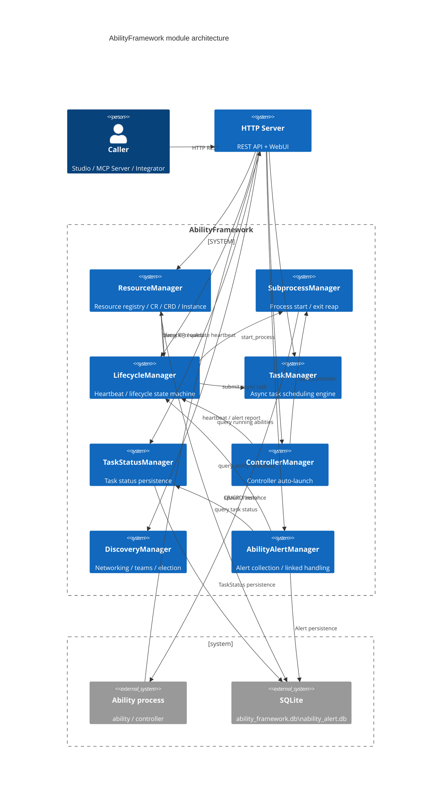
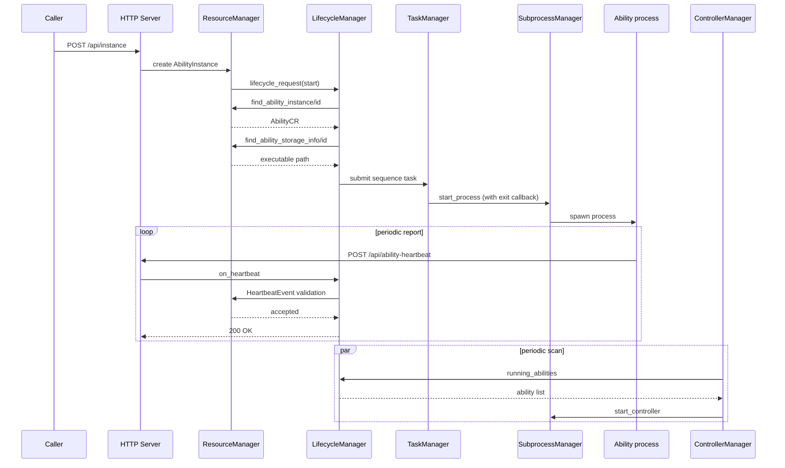

# Overview

AbilityFramework consists of several decoupled manager modules. The modules collaborate through a **message bus** (synchronous/asynchronous messages) and the **libuv event loop** (timers, asynchronous tasks), and each exposes REST endpoints to the HTTP server. Each file in this directory introduces a module's responsibilities, interfaces, and configuration.

## Module overview

| Module | Message bus name | Docs | One-line responsibility |
|---|---|---|---|
| ResourceManager | `ResourceMgr` | [resource_manager.md](/en/guide/concepts/architecture) | Registry of ability/device resources, runtime instances, the package repository, and ownership relations |
| SubprocessManager | `SubprocessMgr` | [subprocess_manager.md](/en/guide/concepts/architecture) | Starting, handle maintenance, and exit reaping of ability and controller processes |
| LifecycleManager | `LifecycleMgr` | [lifecycle_manager.md](/en/guide/concepts/architecture) | Ability heartbeat maintenance and the lifecycle state machine |
| TaskManager | `TaskMgr` | [task_manager.md](/en/guide/concepts/architecture) | The asynchronous task scheduling engine based on C++20 coroutines |
| TaskStatusManager | `TaskStatusMgr` | [task_status_manager.md](/en/guide/concepts/architecture) | Persistence and history queries for task execution status |
| ControllerManager | `ControllerMgr` | [controller_manager.md](/en/guide/concepts/architecture) | Automatic discovery and launch of ability controllers |
| DiscoveryManager | none | [discovery_manager.md](/en/guide/concepts/architecture) | Multi-node networking, team management, and leader election |
| AbilityAlertManager | `AbilityAlertMgr` | [ability_alert_manager.md](/en/guide/concepts/architecture) | Collection, persistence, and linked handling of ability runtime alerts |

## Module startup order

`src/main.cpp` constructs and registers the modules in this order:

```cpp
message_bus::add_modules(
    task_mgr, lifecycle_mgr, resource_mgr,
    subproccess_mgr, task_status_mgr, controller_mgr
);
```

DiscoveryManager and AbilityAlertManager are not registered on the message bus; they are constructed directly and bind their HTTP endpoints.

## Full module collaboration

A typical cross-module chain for "create and start an ability instance":

### Global architecture C4 diagram



### Create and start an ability instance — sequence diagram



Related references:

- [HTTP API reference](/en/api/http-api)
- [Configuration file reference](/en/guide/configuration/config-file)
- [CLI command reference](/en/guide/cli)
