# Ability instances

The ability instance is the core of the AbilityFramework runtime model. It decouples the "ability template (CR)" from the "running process": the template is a static declaration, and the instance is a runtime object derived from the template at a certain moment, with its own `instance_id`, destroyed on exit. This design lets the framework add and remove instances repeatedly at runtime without modifying the template itself.

In short: a CR template is like a class, and an ability instance is like an object. `POST /api/instance` is like `new`, and instance exit is like destruction.

## Why the instance concept is needed

In early versions, a CR was both the template and the runtime entity — starting an ability operated directly on the CR row. This caused three problems:

1. **Single-process restarts polluted the template table**: every start/stop changed state on the CR table, mixing the template's semantics with runtime state.
2. **No support for concurrent instances**: a single CR row could only represent one running process, unable to run multiple copies of the same ability.
3. **Configuration drift**: after an instance started, if someone changed the template's spec, should the running instance work with the old or new spec? There was no clear answer.

The instantiation mechanism solves all three problems with a separate `AbilityInstance` table: the template table only handles declarations, the instance table only handles runtime, and `spec_snapshot` freezes the configuration at the moment of creation.

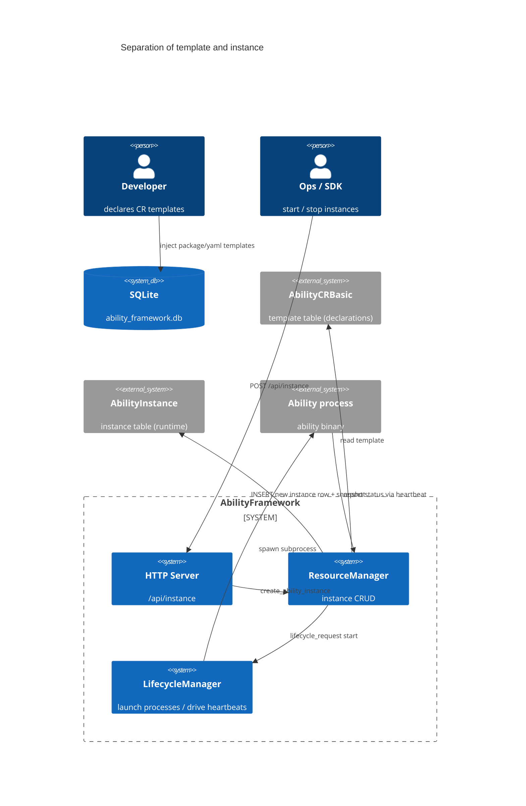

---

## Data model

### `AbilityInstance` table

This is a pure runtime table; each starting or running instance occupies one row. The row is deleted immediately when the instance exits and is not retained in history.

| Field | Type | Description |
|---|---|---|
| `instance_id` | TEXT PK | Runtime instance UUID, generated by `create_ability_instance`, **different from the template's `cr_id`** |
| `cr_id` | TEXT | The owning template (`AbilityCRBasic.instance_id`), an N:1 relation |
| `cr_name` | TEXT | The corresponding template `metadata.name` |
| `instance_name` | TEXT | Instance display name, format `<cr_name>-<first 8 of id>` |
| `ability_name` | TEXT | Ability class name |
| `ability_version` | TEXT | Ability version |
| `pid` | INTEGER | Process PID (reserved, currently unused) |
| `state` | TEXT | Lifecycle state, default `Inactive` |
| `start_time` | INTEGER | Start time (unix seconds) |
| `stop_time` | INTEGER | Stop time |
| `spec_snapshot` | TEXT | AbilityCR JSON snapshot taken at the moment of startup |
| `detail` | TEXT | Extra information JSON (`abilityPort`, `IPCPort`, etc.) |

### Template-to-instance relationship (ER diagram)

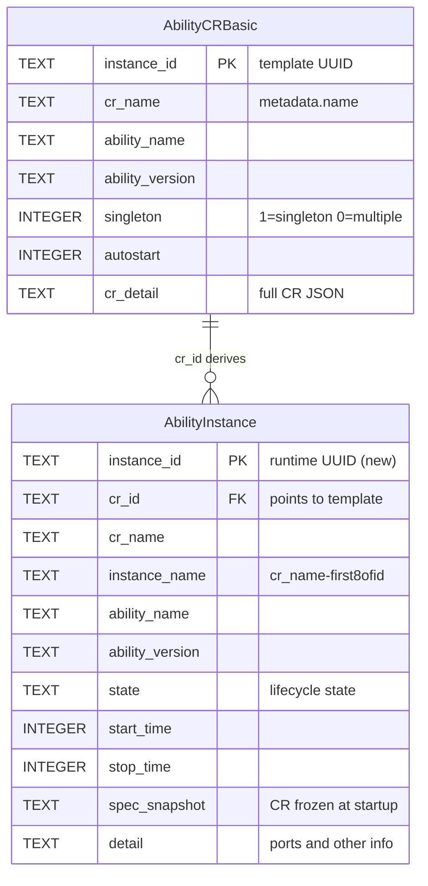

### `spec_snapshot` — the configuration-freezing mechanism

This is the most critical field in the instantiation design. `create_ability_instance` does three things at the moment of creation:

1. Copies the template CR as a `snapshot`;
2. Changes `snapshot.id` to the newly generated `instance_id` (to keep downstream consistent);
3. Sets `lifecycleState` to `Inactive`, serializes it to JSON, and stores it in `spec_snapshot`.

This way, even if the template is later modified or deleted, the running instance still works with the spec from the moment of creation. `resolve_ability_cr_by_id` **reads `spec_snapshot` first**, falling back to the template table only if parsing fails.

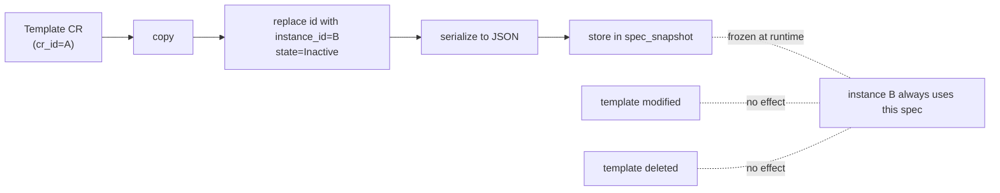

---

## `AbilityInstanceInfo` structure

The instance metadata structure exposed by ResourceManager (`include/resourcemgr/resource_mgr.hpp`):

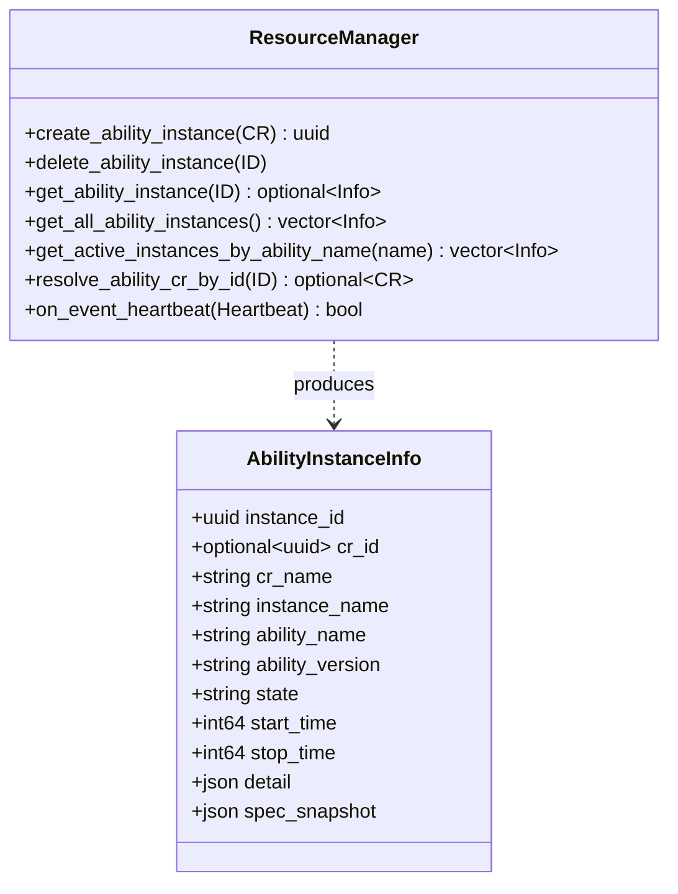

---

## Lifecycle states

An instance's `state` field follows the LifecycleManager state machine (see [Lifecycle manager](/en/guide/concepts/architecture)). The state enum is defined in `include/lifecyclemgr/heartbeat.hpp`:

| State | Value | Meaning |
|---|---|---|
| `Inactive` | 0 | Created but not started / stopped |
| `Init` | 1 | Process launched, initializing |
| `Standby` | 2 | Ready, IPC port bound, can accept connect |
| `Running` | 3 | Running normally |
| `Suspend` | 4 | Suspended |
| `Terminated` | 5 | Terminated (row deleted immediately) |
| `Error` | 66 | Error |
| `Unknown` | 65 | Unknown |

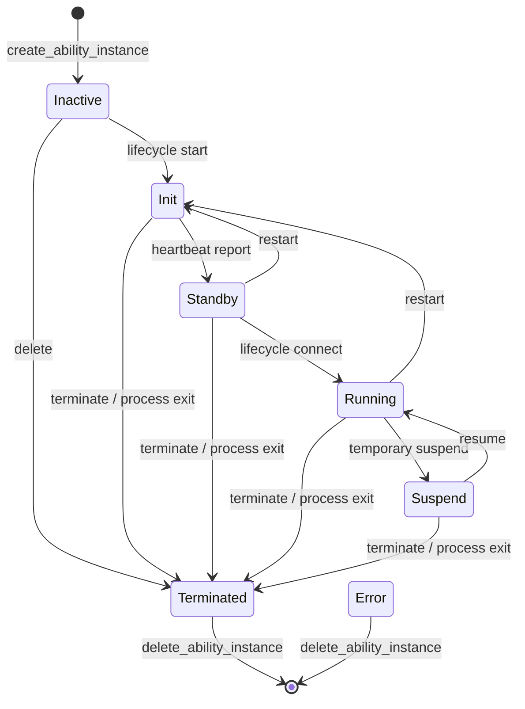

> Key semantics: once an instance enters `Terminated`, `on_event_heartbeat` deletes the row immediately. There are no leftover `Terminated` rows in the instance table — it is just a transient signal that triggers deletion.

---

## The full chain of creating an instance

`POST /api/instance` is the most central entry point. It takes a template reference (name or UUID), derives the instance, and then decides how deep the task chain goes based on the `start` / `connect` parameters.

### Creation sequence diagram

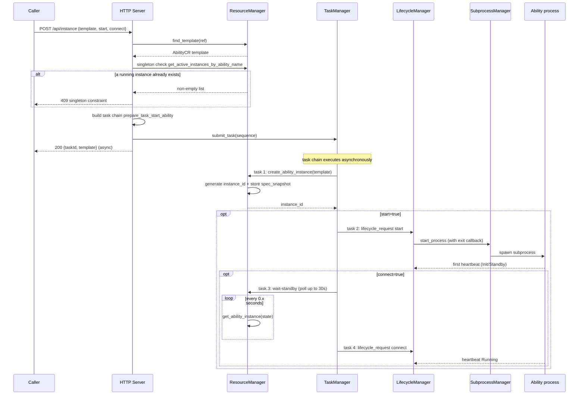

### Four variants of the task chain

`prepare_task_start_ability` (`src/resourcemgr/resource_mgr_http_apis.cpp`) composes different `tasks::sequence`s based on the parameters:

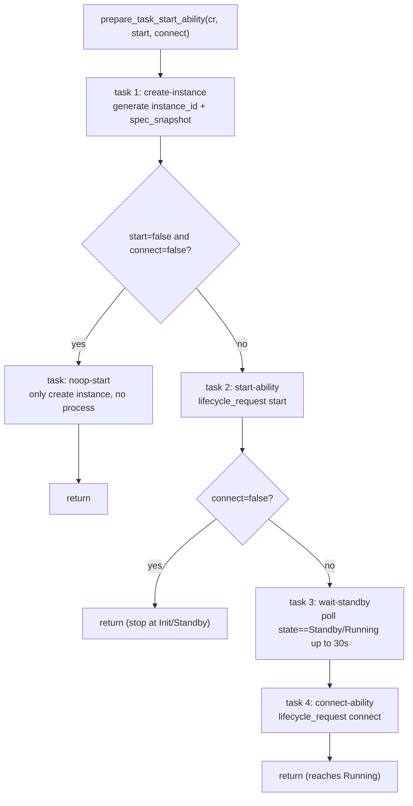

| Call parameters | Task chain | Final state |
|---|---|---|
| `start=false, connect=false` | create-instance → noop-start | Inactive (row created only) |
| `start=true, connect=false` | create-instance → start-ability | Init or Standby |
| `start=true, connect=true` | create-instance → start-ability → wait-standby → connect-ability | Running |
| `start=false, connect=true` | same as above (connect implies start) | Running |

> When `connect` is true, `start` is forced to true (code: `bool start = body.value("start", true); bool connect = start && body.value("connect", true);`).

---

## Singleton constraint

When the template's `spec.singleton` is true (the default), only one active instance of the same ability name is allowed globally. `POST /api/instance` checks this before creating:

```mermaid
flowchart TD
    POST["POST /api/instance"] --> FIND["find_template(template)"]
    FIND -->|not found| NF["404 template not found"]
    FIND -->|found| SG{"spec.singleton?"}
    SG -->|false| GO["continue creating"]
    SG -->|true (default)| ACTIVE["get_active_instances_by_ability_name"]
    ACTIVE --> EMPTY{"active instance list empty?"}
    EMPTY -- no --> CONFLICT["409 singleton constraint\nreturns running_instance_id"]
    EMPTY -- yes --> GO
    GO --> TASK["submit task chain"]
```

`get_active_instances_by_ability_name` queries rows with `state NOT IN ('Inactive', 'Terminated')`, i.e. Init / Standby / Running / Suspend all count as active.

---

## use_remote_execution — remote execution mode

The config option `/use_remote_execution` (default `false`) controls the startup path. When true, `POST /api/instance` skips the manifest lookup and package download and goes straight to `make_task_start_ability`:

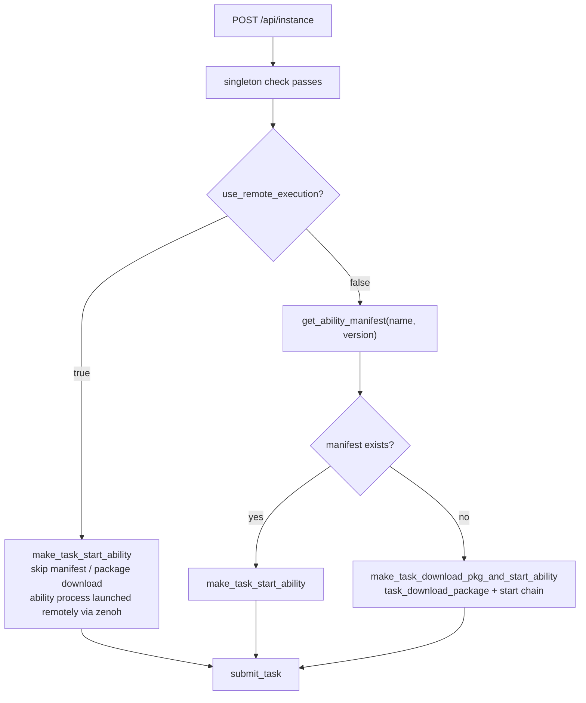

This applies to scenarios where the node itself has no local package directory — the ability process is launched on a remote node via the zenoh protocol, and the local framework only sends lifecycle_request and maintains the heartbeat state.

---

## Heartbeat and status updates

After the ability process starts, it periodically reports a `Heartbeat` (including `id`, `state`, `abilityPort`, `IPCPort`) via `POST /api/ability-heartbeat`. When the heartbeat arrives, LifecycleManager forwards it to ResourceManager's `on_event_heartbeat`:

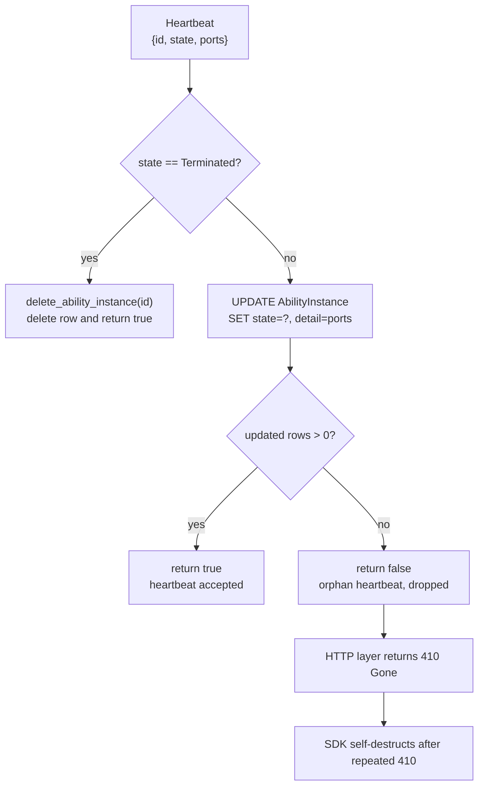

### Orphan heartbeat handling

Historically, `on_event_heartbeat` would INSERT an "orphan heartbeat" placeholder row when UPDATE matched 0 rows. This fallback produced **ghost instances** after a framework restart: a previous generation of reparented-to-init python zombie processes still sent heartbeats, and the framework created Running rows unrelated to any template with `spec_snapshot = null`, which was very hard to debug.

The current fix is to **drop orphan heartbeats directly**, returning false so the LifecycleManager HTTP layer returns `410 Gone`, and the SDK self-destructs after receiving repeated 410s. Logging is rate-limited with `LOG_FIRST_N(WARNING, 20)`, printing only the first 20.

---

## Terminating an instance

`DELETE /api/instance/:id` is responsible for destroying an instance. Its logic is "try a graceful terminate first, then fall back to deleting the row":

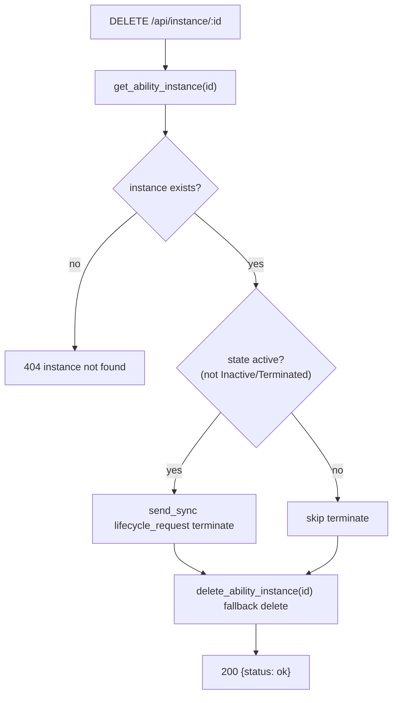

After the terminate command is sent to LifecycleManager, normally the heartbeat callback or process-exit callback triggers the row deletion. But `delete_ability_instance` acts as a fallback to guarantee the row is removed even if lifecycle does not call back in time.

---

## Stale-instance cleanup on startup

After a framework restart, it cannot verify whether old instances are still alive (`PR_SET_PDEATHSIG` + SubprocessManager already killed the orphan processes), so `ResourceManager::init()` marks all non-terminated rows as Terminated:

```sql
UPDATE AbilityInstance
SET state = 'Terminated', stop_time = ?
WHERE state NOT IN ('Terminated', 'Inactive')
```

This solves two problems:

1. The singleton check `get_active_instances_by_ability_name` does not mistakenly think there is a running instance;
2. The WebUI "running instances" panel does not show stale Running rows.

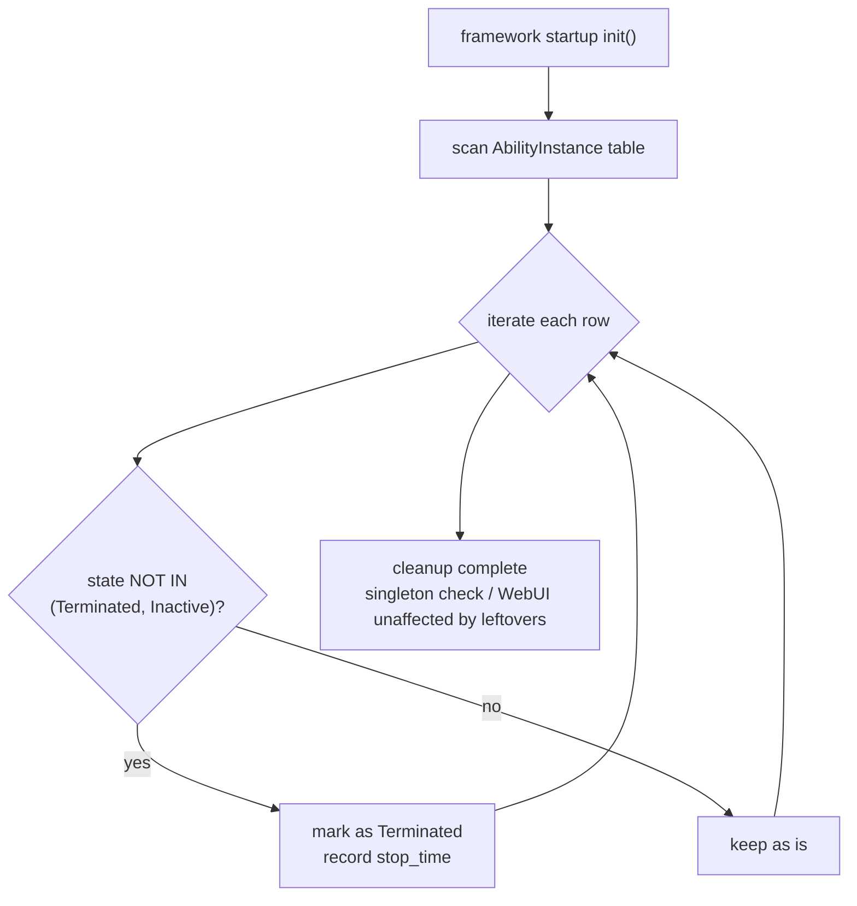

At the same time, it resets `AbilityCRBasic.auto_started = 0`, because the autoStart semantics is "automatically launch once on every framework startup", not "launch only once across the CR's entire lifecycle".

---

## autoStart — auto-launch on startup

CR templates marked with `autostart = 1` are automatically derived and started when the framework boots. The flow is driven by `ResourceManager::auto_start_ability()`:

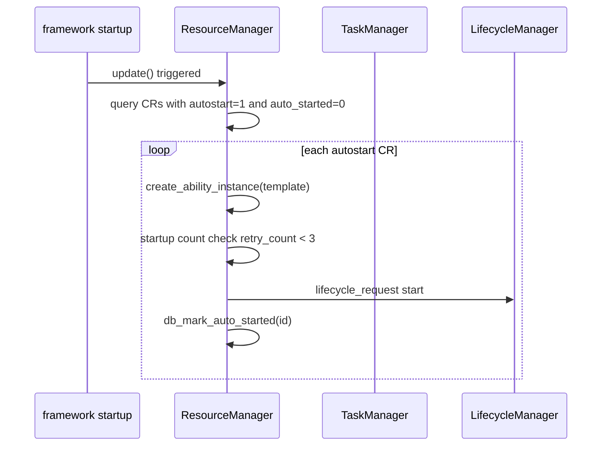

Crash protection is provided by the in-memory `start_records`: if the retry count for an ability in the same session exceeds 3, it is no longer auto-launched, avoiding a crash loop.

---

## HTTP API quick reference

| Method | Path | Description | Key status codes |
|---|---|---|---|
| GET | `/api/instance` | List all instances | 200 |
| GET | `/api/instance/:id` | Query a single instance | 200 / 404 |
| POST | `/api/instance` | Derive from template and start | 200 / 404 / 409 |
| DELETE | `/api/instance/:id` | Terminate and destroy | 200 / 404 |

### POST request body

```json
{
  "template": "my-ability",
  "start": true,
  "connect": true
}
```

- `template`: required, CR name or UUID.
- `start`: defaults to true, whether to launch the process.
- `connect`: defaults to true, whether to advance to Running (implies start=true).

### Return example

```json
{
  "taskId": "task-uuid",
  "template": "my-ability"
}
```

Creation is asynchronous — after the task chain is submitted to TaskManager, it immediately returns a `taskId`; actual startup progress requires polling the instance state or querying TaskStatus.

### GET response fields

```json
{
  "instance_id": "uuid",
  "cr_id": "template uuid",
  "cr_name": "my-ability",
  "instance_name": "my-ability-a1b2c3d4",
  "ability_name": "mover",
  "ability_version": "1.0.0",
  "state": "Running",
  "start_time": 1700000000,
  "stop_time": null,
  "detail": {"abilityPort": 8081, "IPCPort": 8082},
  "spec_snapshot": {}
}
```

---

## Related references

- [Resource manager](/en/guide/concepts/architecture)
- [Lifecycle manager](/en/guide/concepts/architecture)
- [Task manager](/en/guide/concepts/architecture)
- [HTTP API reference](/en/api/http-api)
- [Configuration file reference](/en/guide/configuration/config-file)
- [Message bus](/en/guide/concepts/architecture)
