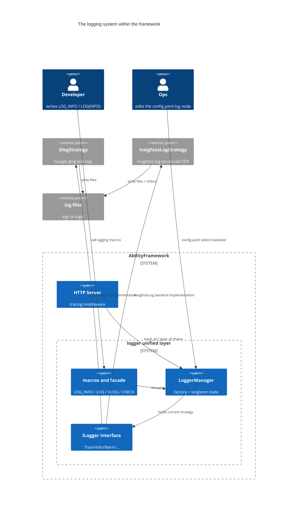
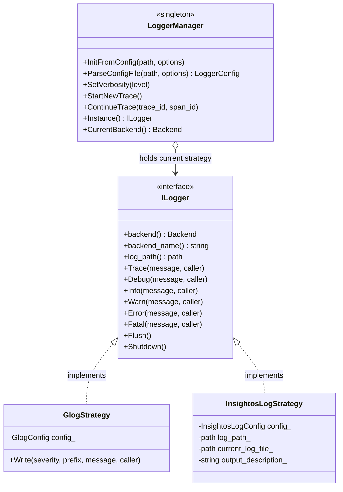
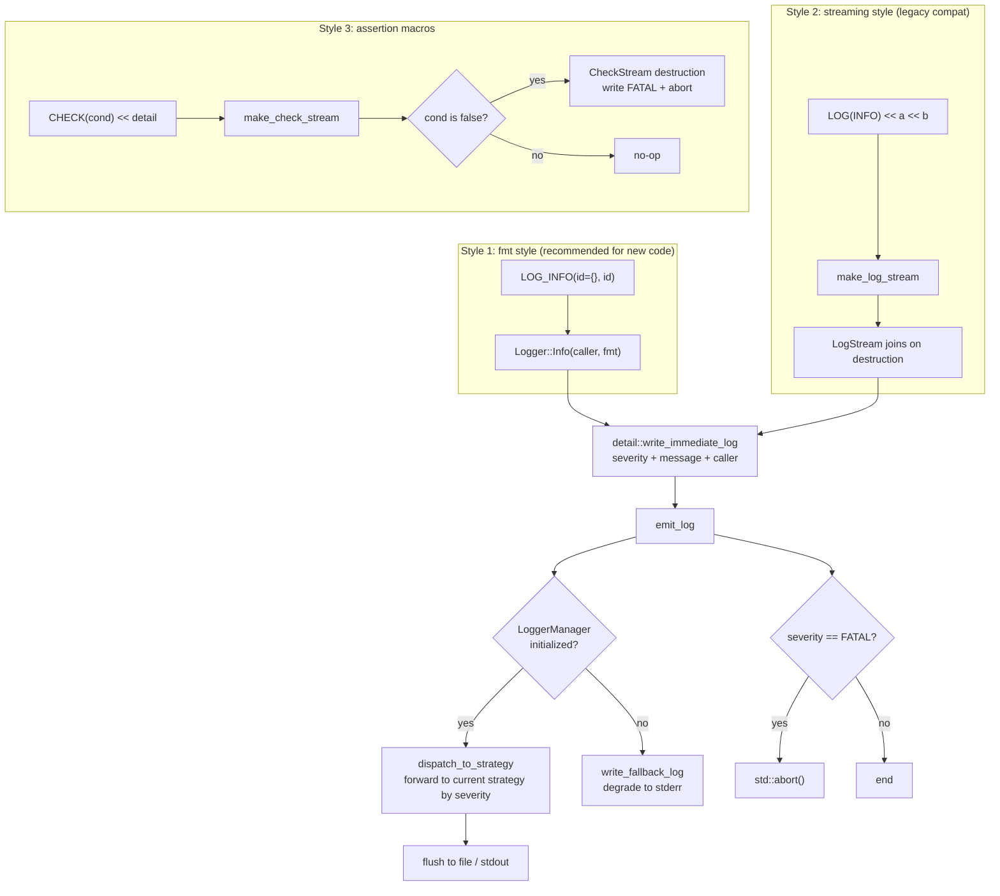
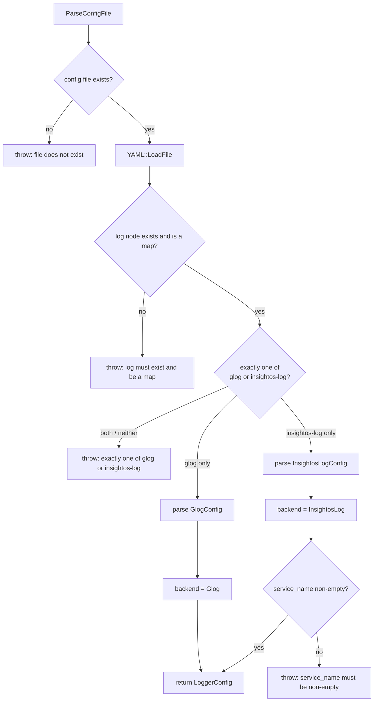
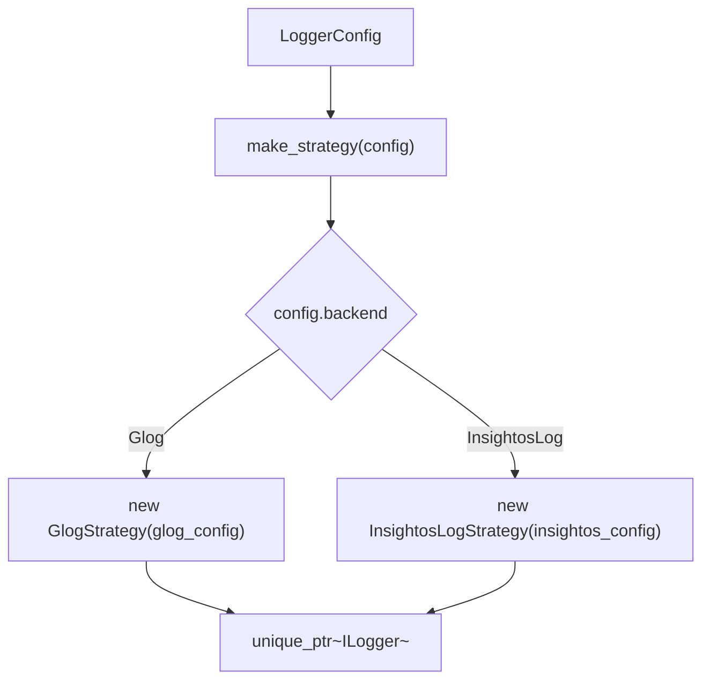
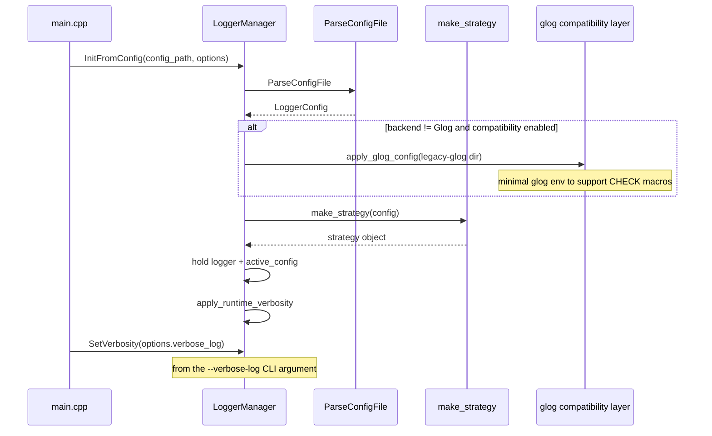
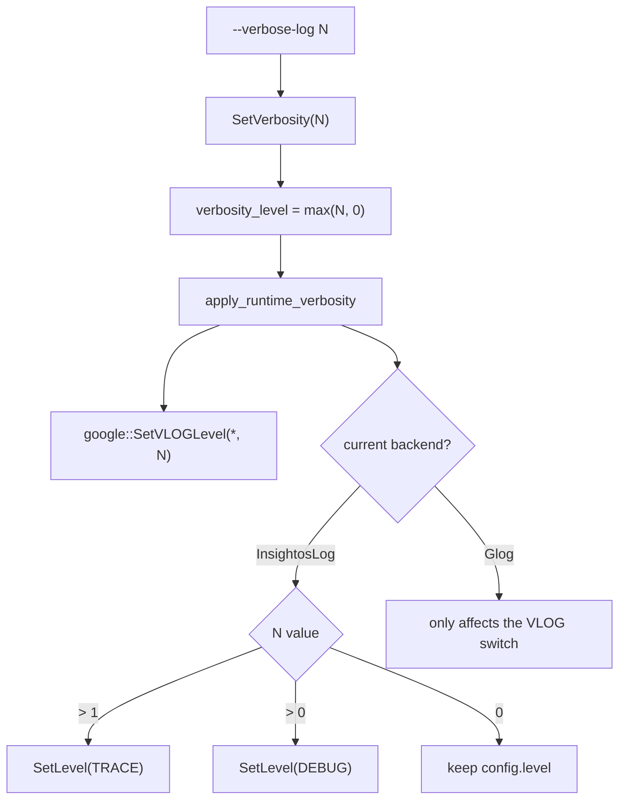
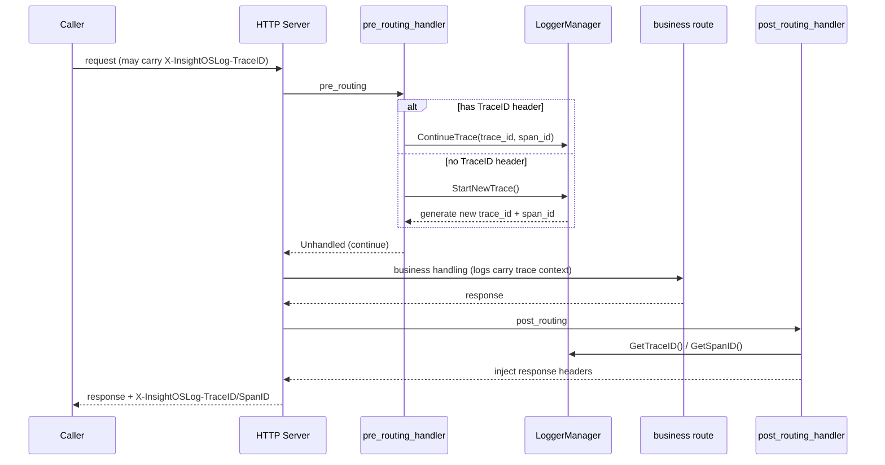
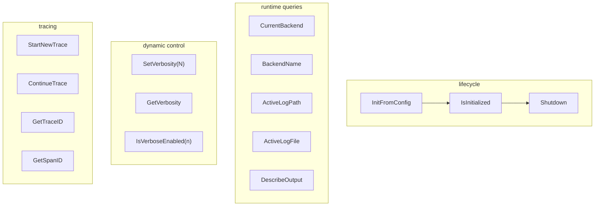

# Logging

::: info
Related configuration: the `log` option in `config.yaml`
:::

The logging system is one of AbilityFramework's core infrastructure pieces. It uses a **unified logging layer** to hide the underlying backend differences, so business code does not care whether the current backend is Google glog or the insightos-log SDK, while remaining compatible with both the legacy glog streaming style and the fmt style preferred by new code. The core design is the **strategy pattern + a singleton manager**: one `ILogger` interface, two implementations, a factory plus a state container.

## Architecture overview



---

## Strategy pattern and class structure

### Backend selection

The `logger::Backend` enum exposes only the backend kind without binding to a specific third-party library type, so that adding a third logging implementation requires no changes to callers or most of the initialization logic.

| Backend | Strategy class | Characteristics |
|---|---|---|
| `Glog` | `GlogStrategy` | Process-level text logger, compatible with legacy glog calls |
| `InsightosLog` | `InsightosLogStrategy` | Structured logging SDK, supports service metadata and tracing |



### Why the two backends cannot share one set of fields

The models of glog and insightos-log do not align: glog is more like a "process-level text logger", while insightos-log is a "structured logging SDK". So the configuration is modeled separately first (`GlogConfig` and `InsightosLogConfig`), and then an exclusive selection is made through `LoggerConfig`, avoiding forcing the two backends into a single set of fields. `LoggerManager` only needs to hold the one decision result — "the currently selected backend + that backend's config" — to rebuild or switch the strategy object at runtime.

---

## Three call styles

Regardless of which style business code uses, it ultimately goes through the same strategy dispatch path (`detail::write_immediate_log`).



### Style 1: fmt formatting macros (recommended)

New code should prefer the fmt style and avoid piling on more `<<`:

```cpp
LOG_TRACE("trace detail {}", ctx);
LOG_DEBUG("debug id={}", id);
LOG_INFO("server started on {}:{}", ip, port);
LOG_WARN("retry {}/{}", attempt, max);
LOG_ERROR("failed to parse {}", path);
LOG_FATAL("unreachable");
```

When the macros expand, they capture call-site information via `__FILE__` / `__LINE__` / `__PRETTY_FUNCTION__`, then hand it to the `Logger` facade to format and dispatch. This way both backends receive unified caller metadata, lowering the cost of locating logs during retrieval.

### Style 2: streaming macros (compatible with glog style)

Legacy code heavily uses `LOG(INFO) << a << b`. Hand-migrating all of it to the fmt style is costly and error-prone, so the unified layer uses a temporary stream object `LogStream` to first assemble the text and then commit it uniformly on destruction, achieving "compatible call form, unified backend implementation":

```cpp
LOG(INFO) << "create ability instance " << id << " from " << name;
LOG(WARNING) << "dropping orphan heartbeat from " << id_str;
```

`VLOG(n)` maps to `StreamSeverity::DEBUG` and is gated by `LoggerManager::IsVerboseEnabled(n)`. `LOG_IF(level, cond)`, `LOG_FIRST_N(level, count)`, and `DLOG(level)` are likewise redirected to the unified layer.

### Style 3: CHECK assertions

`CheckStream` reuses the "commit on destruction" principle, but only outputs a log and aborts the process when the assertion fails, without depending on whether a particular glog distribution provides a complete CHECK macro family:

```cpp
CHECK(ptr != nullptr);
CHECK_NOTNULL(ptr);
CHECK_EQ(a, b) << "a must equal b";
CHECK_NE(a, b);
CHECK_GE(version, 2);
```

Even when business logging switches to insightos-log, the framework still initializes a minimal glog environment in compatibility mode (writing logs to `<home>/log/legacy-glog`) specifically to support assertion macros such as `CHECK`.

---

## Configuration parsing

`LoggerManager::ParseConfigFile` reads the `log` node of config.yaml, performs exclusive validation, and produces a `LoggerConfig`.

### Exclusive validation

`log` is a map that **must and can only** contain exactly one of `glog` or `insightos-log`. Having both or neither throws an exception and causes startup failure.



### Path resolution

Relative paths are resolved against workspace_root (i.e. `ABILITY_FRAMEWORK_HOME` or the process working directory). When insightos-log's `log_root` is empty it falls back to `$HOME/insightoslog`, or `/tmp/insightoslog` if `$HOME` does not exist. The actual landing directory also appends `service_name` and `instance_id`.

### Backend selection flow



### Configuration examples

glog backend:

```yaml
log:
  glog:
    color_log: true
    also_log_to_stderr: false
    max_log_size: 1024
    stop_logging_if_full_disk: true
    log_dir: log
```

insightos-log backend (the default configuration in config.yaml):

```yaml
log:
  insightos-log:
    level: INFO
    service_type: ability
    service_name: AbilityFramework
    instance_id: af
    output: dual
    log_root: logs
    buffer_size: 8192
    flush_interval: 2
    enable_tracing: true
    file:
      max_size: 1048576
      max_files: 3
```

For the full field reference, see [Configuration file reference - the log node](/en/guide/configuration/config-file#log-logging-configuration).

---

## Initialization flow

The logging system is initialized **earliest** in `src/main.cpp`, before module construction and database initialization. If the backend is not decided here first, a split state would emerge at runtime where "some logs go to glog, others go to the new interface".



### `LoggerInitOptions`

Runtime options applied during initialization:

| Field | Default | Description |
|---|---|---|
| `workspace_root` | empty | The base directory for resolving relative paths |
| `force_console_output` | false | Corresponds to the `--log-to-stdout` CLI argument; forces console output |
| `enable_legacy_glog_compatibility` | true | Keeps a minimal glog environment for CHECK/legacy macros during migration |

---

## Verbosity control

The `--verbose-log N` CLI argument takes effect via `LoggerManager::SetVerbosity(N)`. It affects two layers simultaneously:

1. The `VLOG(n)` switch: `IsVerboseEnabled(n)` checks `n <= verbosity_level`;
2. glog's `SetVLOGLevel("*", N)`;
3. the insightos-log backend's SDK minimum level (verbosity > 1 lowers to TRACE, > 0 lowers to DEBUG).



---

## Tracing

When the backend is insightos-log and `enable_tracing: true`, the framework maintains a trace chain for each HTTP request and returns `trace_id` / `span_id` to the caller via response headers. All trace methods are no-ops when the backend is Glog, so callers need not check the backend type.

### HTTP middleware

`src/main.cpp` registers two middlewares:

- `set_pre_routing_handler` (request entry): checks the `X-InsightOSLog-TraceID` header; if present it continues the chain, otherwise it starts a new chain;
- `set_post_routing_handler` (response exit): writes the current `trace_id` and `span_id` into the response headers.



### Trace method reference

| Method | Description | Glog backend behavior |
|---|---|---|
| `StartNewTrace()` | Starts a new trace chain for the current thread | no-op |
| `ContinueTrace(trace_id, span_id)` | Continues an existing chain | no-op |
| `GenerateSpanID()` | Generates a new span id | returns empty string |
| `GetTraceID()` | Gets the current trace id | returns empty string |
| `GetSpanID()` | Gets the current span id | returns empty string |

After the caller gets the trace_id from the response header, it can correlate all logs of the same request in the logging system to form a complete call-chain view.

---

## Environment variable interactions

| Environment variable | Description |
|---|---|
| `ABILITY_FRAMEWORK_HOME` | The framework's home directory; relative log paths are resolved against it |
| `LOG_LEVEL` | Automatically set and injected into subprocesses when using the insightos-log backend, keeping their log level consistent with the main process |
| `HOME` | The fallback base directory when insightos-log's `log_root` is empty |

The `--log-to-stdout` CLI argument forces `force_console_output = true`: the glog backend enables `also_log_to_stderr`, and the insightos-log backend switches from `rotate_file` to `dual` if so configured.

---

## Runtime control interface



`LoggerManager` is essentially a factory + singleton state container: it parses the configuration and validates exclusivity, creates and holds the current strategy object, and exposes runtime information such as the current backend, output path, and verbosity. All static methods are thread-safe through the internal `LoggerState` (a mutex-protected `unique_ptr<ILogger>` + `LoggerConfig` + atomic verbosity).

### FATAL semantics

After a log is flushed, `emit_log` calls `std::abort()` to terminate the process if the severity is `FATAL`, preserving the glog-era "fatal log means termination" semantics. `CHECK` assertion failures also go through this path.

---

## Related references

- [Configuration file reference](/en/guide/configuration/config-file)
- [CLI command reference](/en/guide/cli)
- [Skill document system](/en/guide/release-highlights/skill)
- [Ability instances](/en/guide/release-highlights/instance)
