# Skill

Skill is a **core new feature** introduced by AbilityFramework. It lets an ability package carry AI-Agent-facing **skill documents** that are mirrored to a fixed location by the framework at install time and then exposed via HTTP API to the WebUI, MCP Server, and upper-layer integrators. Its goal is to make "how an ability package is called by an LLM" a first-class citizen of the framework with minimal intrusion.


::: info
The package author puts a `skills/` directory in the zip; the framework hosts it automatically, and the Agent can discover and read these documents.
:::


## The problem it solves

Before Skill, an ability package could only describe its own **runtime model** (CR/CRD: what parameters an ability has and what fields it returns), but could not describe **how to call it with an LLM** — for example, "which API to call first, how to fill the parameters, what a typical prompt looks like." This knowledge was scattered across wikis, READMEs, and even verbal agreements.

Skill turns this kind of knowledge into **document assets published with the package**: the package author writes it once, the framework hosts it uniformly, and all consumers (WebUI, MCP Server, Agent) discover it from the same fixed location without maintaining their own copies.

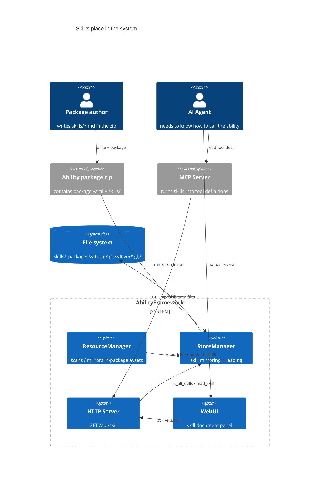

---

## Core concepts

| Concept | Description |
|---|---|
| **Skill file** | A text file (markdown / txt / json or any extension) describing how to use an ability that an Agent can call |
| **In-package skill** | A file under the `skills/` subdirectory of the ability package zip, published with the package |
| **Mirror** | At install time, recursively copies `skills/**` to `<framework_home>/skills/_packages/<pkg>/<version>/` |
| **SkillEntry** | Metadata of a single skill: package name, version, filename, size, title |
| **Consumers** | WebUI (manual review), MCP Server (turns into tool definitions), upper-layer Agent (decides how to call) |

Key design tradeoff: **Skills do not enter the database, do not participate in reconcile, and do not restrict file extensions.** They are pure "packaged document assets"; their lifecycle follows the ability package's install/uninstall entirely and is managed by the file system.

---

## Relationship between Skill and ability package

Skill is an **optional sub-asset** of an ability package. A package's structure looks like this:

```
my-ability-pkg/
├── package.yaml          # required: package metadata (name/version/arch)
├── bin/                  # ability executable
├── crs/                  # optional: in-package CR templates (*.yaml)
├── abilities/            # ability/device CRD definitions
└── skills/               # optional: in-package skill documents (NEW)
    ├── SKILL.md          # main skill description
    └── tasks/
        ├── move.md       # sub-task description (supports nested directories)
        └── grasp.md
```

The `skills/` directory can be any depth and any extension. The framework preserves the directory structure recursively when mirroring and locates files by relative path when reading.

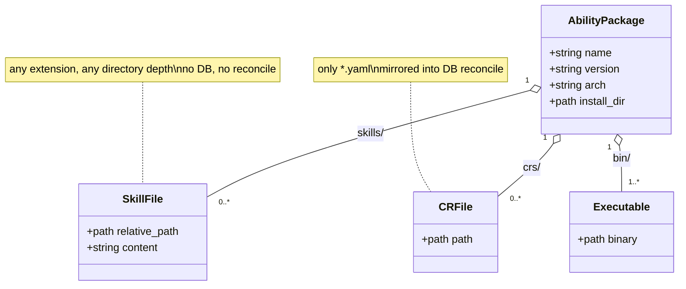

Both Skill and CR are "in-package assets", but their positioning is completely different; there is a dedicated comparison below.

---

## The mirroring mechanism

### Mirror directory layout

The framework mirrors all packages' skills uniformly under `$ABILITY_FRAMEWORK_HOME/skills/_packages/`, layered by `<package>/<version>`, preserving the original directory structure inside:

```
$ABILITY_FRAMEWORK_HOME/
└── skills/
    └── _packages/
        ├── mover/                       # package name
        │   ├── 1.0.0/                   # version
        │   │   ├── SKILL.md
        │   │   └── tasks/
        │   │       └── move.md
        │   └── 1.1.0/
        │       └── SKILL.md
        └── gripper/
            └── 2.0.0/
                └── SKILL.md
```

This layout is **machine-enumerable**: `list_all_skills()` first scans two layers of directories (package/version), then recursively grabs all regular files within each version directory. Consumers do not need to know how a package was installed; they only read from this fixed root.

### Mirror data flow

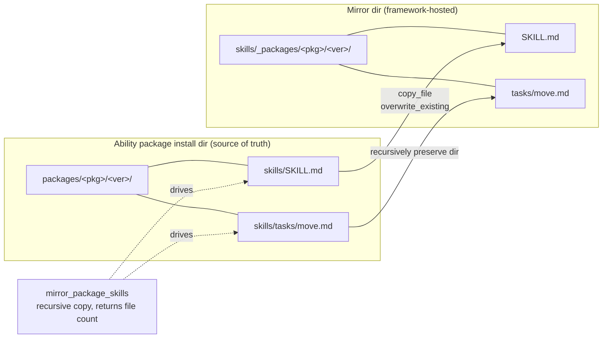

### Three mirror trigger points

Mirroring happens at **three points** in the ability package lifecycle, guaranteeing that no matter how a package arrives, its skills eventually land:

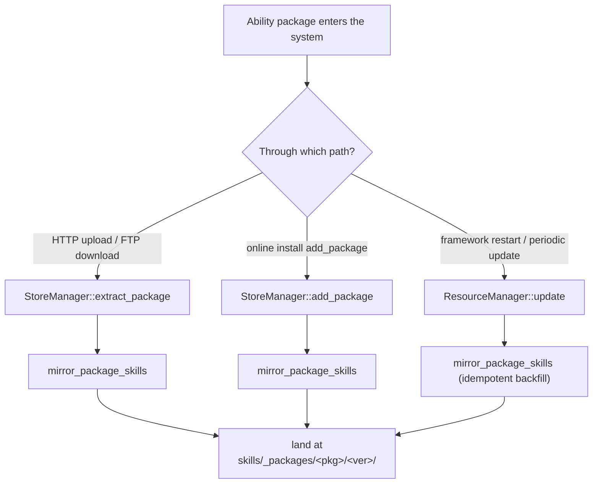

| Trigger point | Function | Scenario | Idempotent |
|---|---|---|---|
| Extract install | `extract_package` | HTTP/FTP uploaded zip | yes (overwrite_existing) |
| Online install | `add_package` | `POST /api/package` online install | yes |
| Periodic update | `ResourceManager::update` | framework startup + timer; backfills mirroring for all existing packages | yes |

> The mirroring call inside `update()` is a **key fallback design**: the comment explicitly states "the install path already called this in add_package / extract_package, but for old packages that existed when the framework started (which never went through the install path), we backfill once here so the packages directory is the source of truth." This means that even if you manually copy a package into the `packages/` directory, the next update will automatically mirror its skills.

### Mirror function details

Behavior of `mirror_package_skills`:

1. Checks whether `<pkg_install_dir>/skills` exists and is a directory; if not, returns 0 directly
2. Creates the destination mirror directory
3. Uses `recursive_directory_iterator` to traverse all files under `skills/`
4. For each regular file, preserves the relative path, `copy_file` and overwrites the existing file
5. A single failed file copy only logs a WARNING and continues (does not abort the whole), and returns the count of successfully copied files

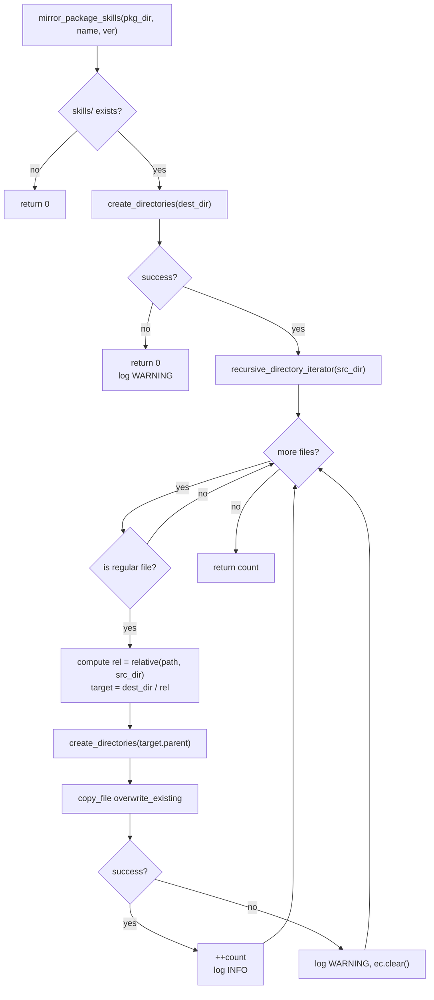

---

## Uninstall and cleanup

When an ability package is uninstalled, its mirrored skills are removed synchronously. `unmirror_package_skills` accepts an optional version number: passing a specific version deletes only that version, and passing an empty string deletes all versions of the package.

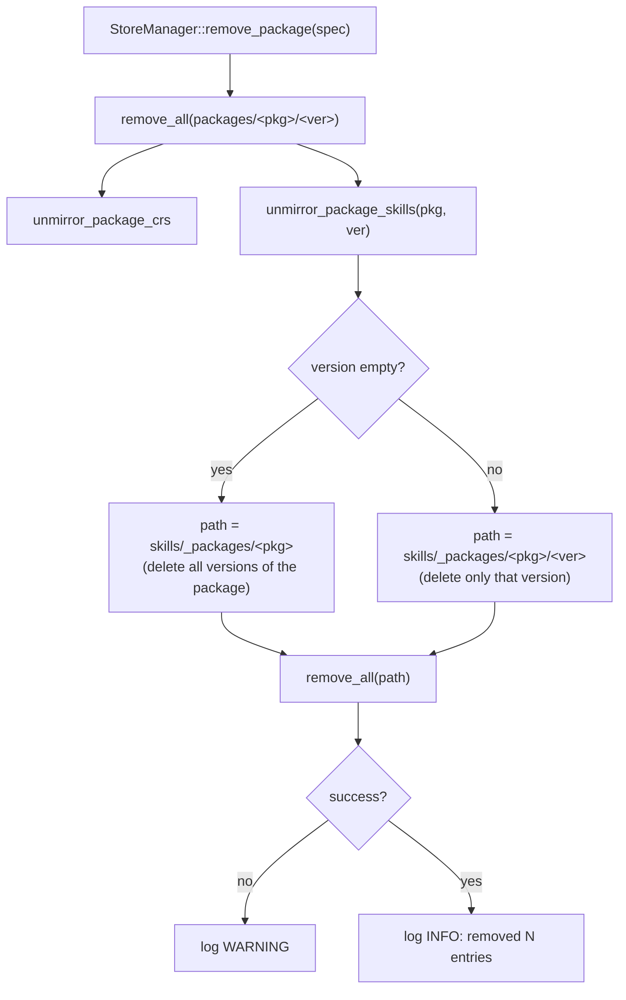

Cleanup is strictly symmetric with mirroring: whatever was mirrored is removed on uninstall, leaving no orphan documents.

---

## Skill lifecycle

The complete state transitions of a skill file from authoring to disappearance:

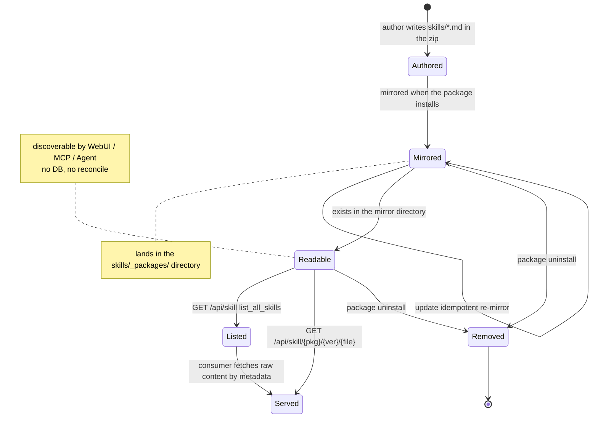

---

## Install sequence

A complete chain of "upload an ability package with skills → mirror → readable":

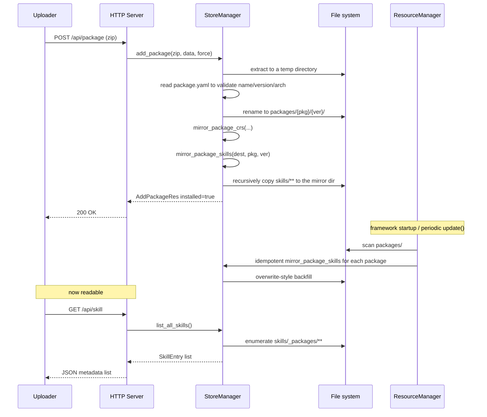

---

## HTTP API

Skills are exposed through two GET endpoints, both registered in `resource_mgr_http_apis.cpp`.

### `GET /api/skill` — list all skill metadata

Returns a JSON array where each item is a `SkillEntry`. It traverses all packages/versions under `skills/_packages/` and recursively grabs files.

Response example:

```json
[
  {
    "package": "mover",
    "version": "1.0.0",
    "filename": "SKILL.md",
    "size": 1234,
    "title": "Movement ability usage guide"
  },
  {
    "package": "mover",
    "version": "1.0.0",
    "filename": "tasks/move.md",
    "size": 567,
    "title": "Linear move task"
  }
]
```

### `GET /api/skill/:package/:version/*filename` — read a single skill's raw content

Uses the wildcard regex `([^/]+)/([^/]+)/(.+)` to capture the package name, version, and filename (the filename may include subdirectories, e.g. `tasks/move.md`). Returns the raw `text/markdown; charset=utf-8` content. Returns 404 + a JSON error body if not found.

```
GET /api/skill/mover/1.0.0/SKILL.md           → 200 text/markdown
GET /api/skill/mover/1.0.0/tasks/move.md      → 200 text/markdown
GET /api/skill/mover/1.0.0/nope.md            → 404 {"error":"skill not found",...}
GET /api/skill/mover/1.0.0/../../etc/passwd   → 404 (path traversal blocked)
```

### Call relationship between the API and StoreManager

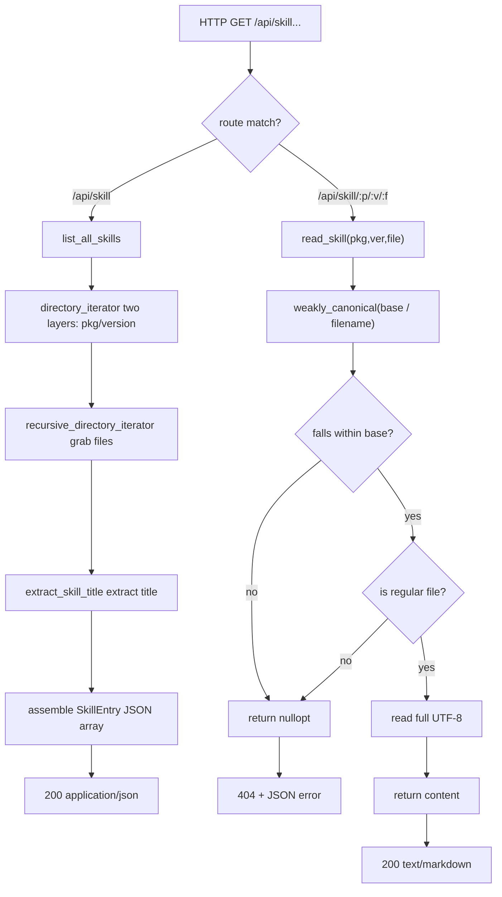

---

## Path traversal protection

`read_skill` has an explicit path traversal guard. Because the filename comes from external HTTP input, it must prevent attacks like `../../etc/passwd` from reading arbitrary files.

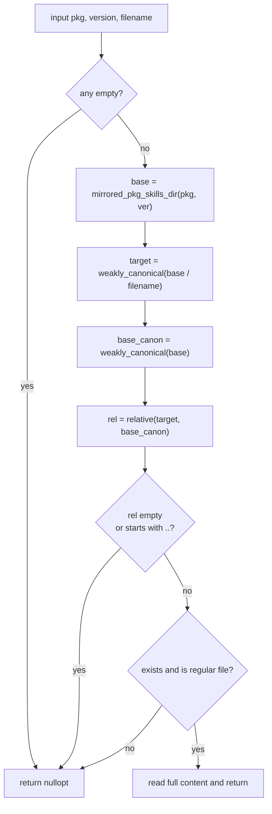

Only when the resolved canonical path **strictly falls within the mirror directory** is reading allowed. Even if `..` is stuffed into the package name/version, it is intercepted after canonicalization.

---

## Title extraction

The `title` field returned by `list_all_skills` is generated by `extract_skill_title`, which tries to grab a readable title from the first 60 lines of the skill file so that consumers can display it without reading the whole file. Extraction order:

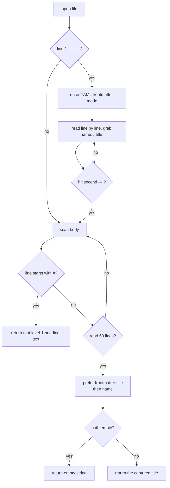

In other words, the priority is: **the first `#` heading in the body > frontmatter `title:` > frontmatter `name:` > empty string**. The value is trimmed of leading/trailing whitespace and surrounding quotes. This covers the two mainstream markdown skill writing styles (with and without frontmatter).

---

## StoreManager's Skill interface

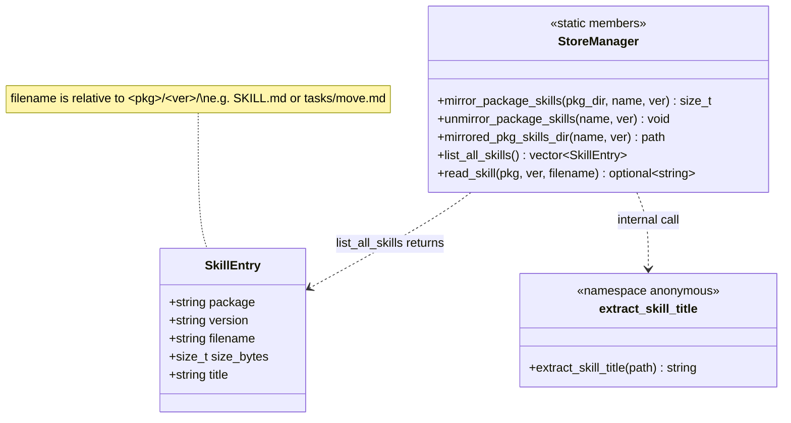

| Method | Purpose | Caller |
|---|---|---|
| `mirror_package_skills` | Recursively copy skills/ to the mirror dir | extract / add / update |
| `unmirror_package_skills` | Delete mirror (supports deleting only a version) | remove_package |
| `mirrored_pkg_skills_dir` | Compute the fixed mirror path | internal / diagnostics / tests |
| `list_all_skills` | Enumerate all skill metadata | `GET /api/skill` |
| `read_skill` | Read a single skill's raw content (with traversal guard) | `GET /api/skill/:p/:v/:f` |

---

## Skill vs CR mirroring

Skill mirroring and CR mirroring are **isomorphic** designs (the same mirror/unmirror/mirrored_dir trio, the same three trigger points), but their semantics differ completely. Understanding this pair helps you quickly grasp the framework's overall approach to "in-package assets".

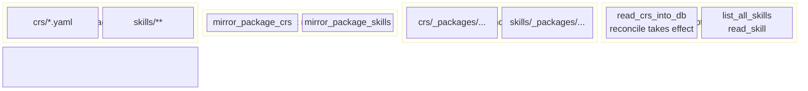

| Dimension | CR mirror | Skill mirror |
|---|---|---|
| Extension | only `*.yaml` | any (md/txt/json/...) |
| Enters DB | yes, `read_crs_into_db` parses into the DB | no, pure file asset |
| Participates in reconcile | yes, `update()` keeps/deletes CR rows | no, unrelated to the runtime model |
| Directory layering | `crs/_packages/<pkg>/<ver>/` | `skills/_packages/<pkg>/<ver>/` |
| Consumption | in-process DB query | HTTP API + file read |
| Positioning | runtime model (ability params/returns) | Agent documentation (how to call) |

In one sentence: CR describes "what the ability looks like", and Skill describes "how to use the ability". The former is for the framework and scheduler; the latter is for the LLM.

---

## Consumer perspective

### WebUI

The WebUI has a dedicated "Skill documents" panel (`panel-skills`) that lists all skills (package, version, file, title, size) in a table and reads the raw content on "view".

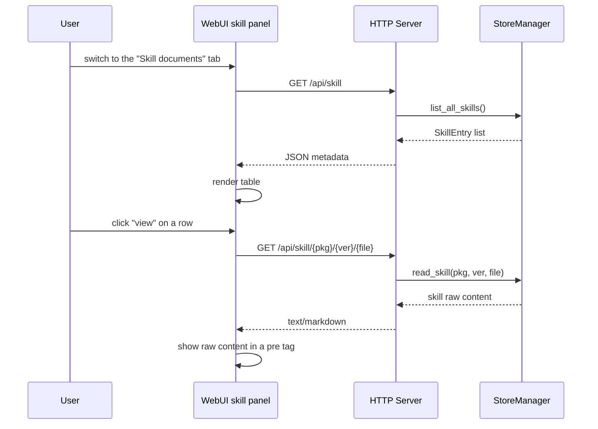

### MCP Server / Agent

The MCP Server is the main automated consumer of skills: it turns skill documents into tool definitions that the LLM can understand, and the Agent decides when and how to call the corresponding ability based on them.

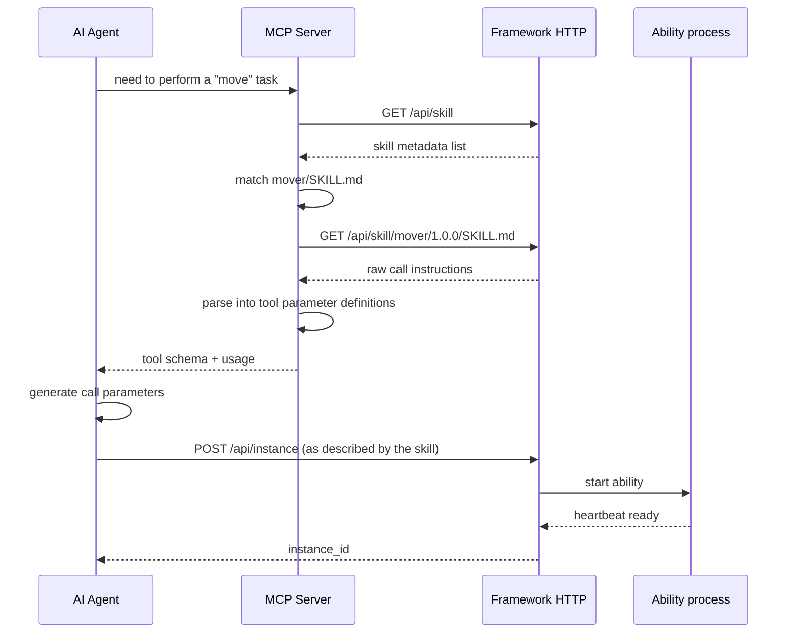

### Manual vs automated discovery comparison

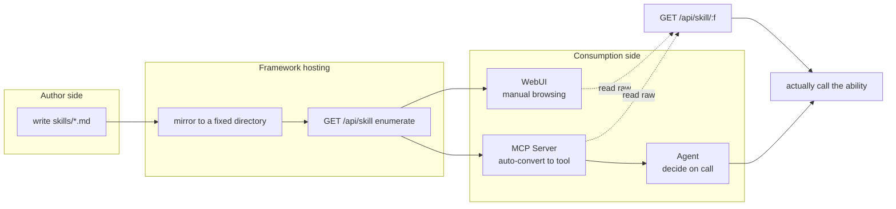

---

## Full lifecycle overview

Connecting all the pieces, the end-to-end flow of a skill document from creation to disappearance:

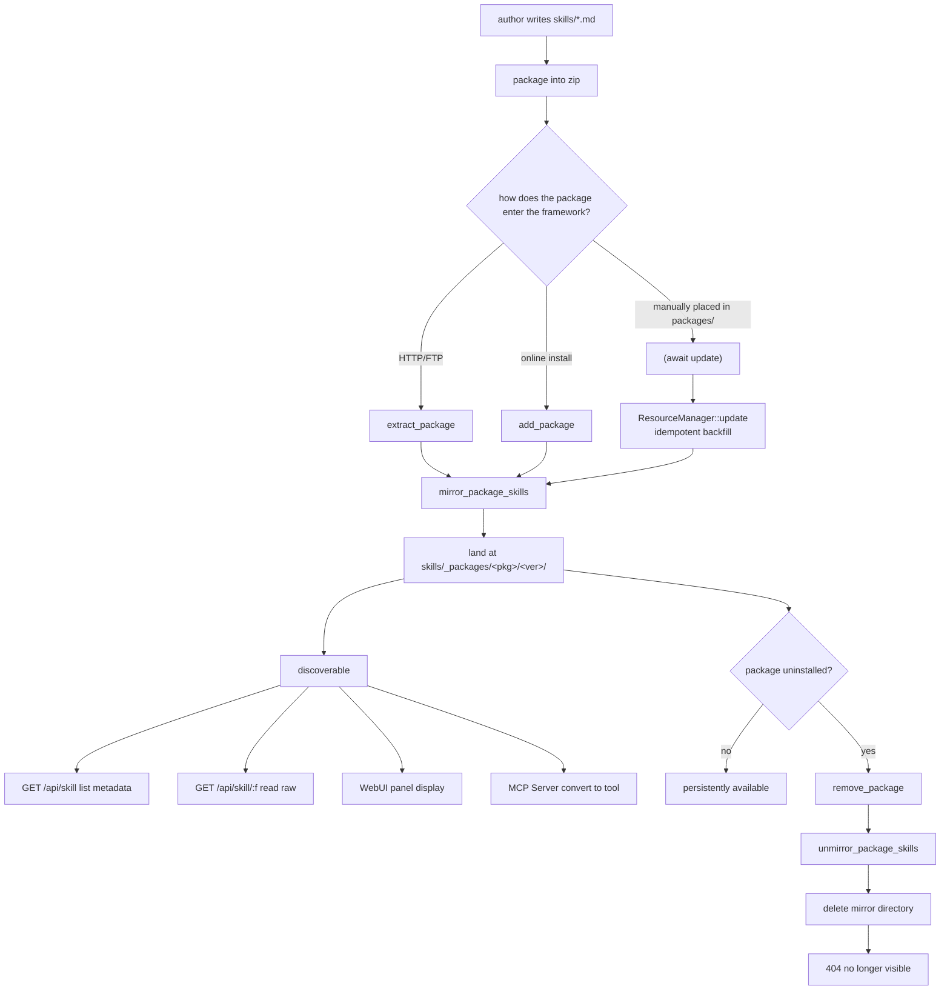

---

## Writing a Skill file

Package authors only need to place markdown files under `skills/` at the zip root. The framework does not mandate a specific content format, but both mainstream writing styles have their titles extracted correctly.

**Style 1: heading only**

```markdown
# Movement ability usage guide

This ability supports moving the robot to a given coordinate. First call ...
```

**Style 2: with frontmatter** (using three equals fences instead of the yaml separator as an example)

```text
name: move_skill
title: Linear move task
---
# Linear move task

Create an instance via POST /api/instance; the velocity parameter is in m/s ...
```

In both styles, `extract_skill_title` grabs a title (style 2 prefers the frontmatter `title:`). It is recommended to give each skill at least a clear title and a "how to call" section so the Agent can understand it.

Related references:

- [Module documentation overview](/en/guide/concepts/architecture)
- [Resource manager](/en/guide/concepts/architecture)
- [HTTP API reference](/en/api/http-api)
- [Message bus](/en/guide/concepts/architecture)
- [Directory structure](/en/guide/concepts/architecture)
