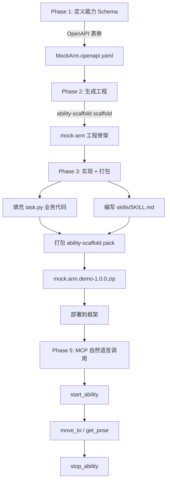

# First Project

从零开始，完成一个机械臂控制能力的**定义 → 生成 → 实现 → 打包**全流程，并接入 MCP 自然语言调用。

## 创建项目流程图



## Phase 1 — 用表单定义能力 Schema

### 1.1 启动 OpenAPI 表单

```bash
chmod +x openapi-tool-v1.0.0-linux-x86_64
./openapi-tool-v1.0.0-linux-x86_64 serve --port 5000
```

浏览器打开 `http://localhost:5000/form`。

### 1.2 填写能力信息

在表单中填入以下信息（以 mock 机械臂为例）：

**基本信息**：

| 字段 | 值 |
|------|------|
| 能力名称 (title) | `MockArm.Demo` |
| 版本 (version) | `1.0.0` |
| 描述 | Mock 机械臂控制演示能力 |

**InsightOS 扩展**：

| 字段 | 值 |
|------|------|
| 包名 (packageName) | `mock.arm.demo` |
| 资源类型 (kind) | `AtomAbility` |

**CR 选项**：

| 字段 | 值 |
|------|------|
| 单例模式 (singleton) | 不勾选 (false) |
| 自动启动 (autoStart) | 不勾选 (false) |

**任务 (Tasks)** — 添加两个任务：

| taskType | taskName | summary |
|----------|----------|---------|
| 0 | MoveTo | 移动到目标位置 |
| 1 | GetPose | 获取当前位姿 |

**MoveTo 参数**：

- `x` (number, 必填, 目标 X 坐标 米)
- `y` (number, 必填, 目标 Y 坐标 米)
- `z` (number, 必填, 目标 Z 坐标 米)
- `speed` (number, 可选, 速度缩放 0~1)

**MoveTo 返回**：

- `success` (boolean, 是否到达)
- `error_distance` (number, 误差距离 米)

**GetPose 参数**：无

**GetPose 返回**：

- `x` (number)
- `y` (number)
- `z` (number)

### 1.3 导出

1. 点击 **"OpenAPI YAML"** tab → **"下载 OpenAPI"** 按钮，保存为 `MockArm.openapi.yaml`
2. 点击 **"Manifest + CR"** tab，检查生成的 `ability.manifest.yaml` 和 `ability.cr.yaml` 预览是否正确

将 `MockArm.openapi.yaml` 放到本目录下：

```bash
mv ~/Downloads/MockArm.openapi.yaml .
```

按 `Ctrl+C` 停止 openapi-tool。

## Phase 2 — 从 OpenAPI 生成工程

```bash
ability-scaffold scaffold --openapi MockArm.openapi.yaml -o ./mock-arm
```

查看生成的工程：

```
mock-arm/
├── main.py                    # 入口
├── task.py                    # task 实现骨架 (TODO: 填充)
├── ability.cr.yaml            # CR 声明
├── ability.manifest.yaml      # 能力清单
├── requirements.txt           # 依赖 (ability-py>=0.3.0, flask, ...)
└── service/
    ├── __init__.py            # 从 ability_py 导入
    └── ability.py             # 生命周期回调
```

## Phase 3 — 实现业务代码 + 编写 Skill + 打包

### 3.1 实现 task.py

打开 `mock-arm/task.py`，填充 `execute()` 方法。以 mock 实现为例：

```python
from ability_py import TaskInterface
import time
import random


class MoveToTask(TaskInterface):
    """移动到目标位置 (taskType: 0)"""

    def execute(self, input_data: dict) -> dict:
        x = input_data.get("x", 0.0)
        y = input_data.get("y", 0.0)
        z = input_data.get("z", 0.0)
        speed = input_data.get("speed", 0.3)

        # mock: 模拟运动延迟
        duration = max(0.5, 2.0 * (1 - speed))
        time.sleep(duration)

        # mock: 添加微小随机误差
        error = random.uniform(0.0001, 0.003)
        return {
            "success": True,
            "error_distance": round(error, 4),
        }


class GetPoseTask(TaskInterface):
    """获取当前位姿 (taskType: 1)"""

    def execute(self, input_data: dict) -> dict:
        return {
            "x": round(random.uniform(-0.5, 0.5), 4),
            "y": round(random.uniform(-0.3, 0.3), 4),
            "z": round(random.uniform(0.0, 0.6), 4),
        }
```

### 3.2 (可选) 调整 service/ability.py

如果需要在启动时做初始化（如连接真实设备），编辑 `mock-arm/service/ability.py` 的 `on_start()` 和 `on_terminate()`。对于 mock 演示，默认生成的代码已经可用。

### 3.3 编写 Skill 文档

在 `mock-arm/` 下创建 `skills/SKILL.md`，给 MCP agent 提供使用知识：

```bash
mkdir -p mock-arm/skills
```

写入 `mock-arm/skills/SKILL.md`：

```markdown
---
name: mock-arm-control
description: Control a mock robot arm. Use when the user asks to move
             the arm, check position, or do pick-and-place tasks.
---

# Mock Arm Control

## When to use

Trigger this skill when the user mentions:
- moving a robot arm / end-effector
- checking arm position / pose
- pick and place operations

## Canonical workflow

1. `start_ability(template="mockarm-demo-1")`
2. Execute task(s):
   - `mock_arm_demo__move_to(x=0.3, y=0.1, z=0.2, speed=0.5)`
   - `mock_arm_demo__get_pose()`
3. `stop_ability(target="mockarm-demo-1")`

## Tools

### move_to
Move arm to target position.
- **x** (number, required): X coordinate in meters
- **y** (number, required): Y coordinate in meters
- **z** (number, required): Z coordinate in meters
- **speed** (number, optional): Speed scale 0.0~1.0, default 0.3

Returns: `{success: bool, error_distance: number}`

### get_pose
Get current arm position. No parameters.

Returns: `{x: number, y: number, z: number}`

## Gotchas
- Coordinates are in meters, base_link frame
- speed=1.0 is maximum, not recommended for precision tasks
- Always start_ability before calling tasks
```

### 3.4 补齐打包必需件

```bash
cd mock-arm

# 1. package.yaml
cat > package.yaml << 'EOF'
name: mock.arm.demo
version: 1.0.0
arch: x86_64
EOF

# 2. bin/ability 启动脚本
mkdir -p bin
cat > bin/ability << 'LAUNCHER'
#!/bin/bash
SCRIPT_DIR="$(cd "$(dirname "$0")/.." && pwd)"
exec python3 "$SCRIPT_DIR/main.py" "$@"
LAUNCHER
chmod +x bin/ability

# 3. 把 CR 挪到 crs/ (pack.py 会排除根目录的 ability.cr.yaml)
mkdir -p crs
mv ability.cr.yaml crs/mockarm-demo-1.cr.yaml

cd ..
```

### 3.5 打包

```bash
ability-scaffold pack ./mock-arm -o mock.arm.demo-1.0.0.zip
```

输出类似：

```
打包工程: ./mock-arm
  包名: mock.arm.demo
  版本: 1.0.0
  架构: x86_64

包已生成: mock.arm.demo-1.0.0.zip (xx KB)
```

打包完成后，参照 [快速开始](./quick-start) 将能力包部署到框架。

## Phase 5 — 通过 MCP + OpenClaw 用自然语言调用能力

[快速开始](./quick-start) 验证了 HTTP API 调用能力的完整链路。本阶段接入 MCP Server，让 AI agent（如 OpenClaw / Claude Code）通过自然语言操控你的能力。

### 5.1 解压并安装 MCP Server

```bash
unzip ability-mcp-server.zip
cd ability-mcp-server
python3 -m venv .venv
source .venv/bin/activate
pip install -e .
cd ..
```

验证安装：

```bash
ability-mcp-server/.venv/bin/python -m ability_mcp.native --help
```

### 5.2 在 OpenClaw 中注册 MCP Server

在你运行 OpenClaw 的工作目录下创建或编辑 `.mcp.json`：

```json
{
  "mcpServers": {
    "ability-framework": {
      "command": "/absolute/path/to/mcp-playground/ability-mcp-server/.venv/bin/python",
      "args": [
        "-m", "ability_mcp.native",
        "--framework-url", "http://localhost:8080"
      ]
    }
  }
}
```

> **注意**：`command` 必须是**绝对路径**，指向 MCP Server venv 里的 Python。
> `--framework-url` 指向 [快速开始](./quick-start) 中启动的 AbilityFramework 地址。

Claude Code 用户也使用同样的 `.mcp.json` 格式，放在项目根目录或 `~/.claude.json` 中。

### 5.3 确保框架和能力就绪

```bash
# 确保框架还在跑 (如果已停，重新启动)
cd framework
./AbilityFramework &
cd ..

# 确认能力包已加载
curl -s http://localhost:8080/api/cr | python3 -c "
import sys, json
for c in json.load(sys.stdin):
    print(f'  {c[\"metadata\"][\"name\"]} -> {c[\"spec\"][\"abilityName\"]}')
"
# 应该看到: mockarm-demo-1 -> MockArm.Demo
```

### 5.4 启动 OpenClaw 并用自然语言操控

在配置了 `.mcp.json` 的目录下启动 OpenClaw：

```bash
openclaw    # 或 claude (如果用 Claude Code)
```

MCP Server 会被 OpenClaw 自动拉起。此时 agent 具备以下 MCP 工具：

| 工具 | 作用 |
|------|------|
| `refresh_tools()` | 重新从框架拉取 manifest，更新动态 task 工具 |
| `start_ability(template="mockarm-demo-1")` | 启动能力实例 |
| `stop_ability(target="mockarm-demo-1")` | 停止能力实例 |
| `mock_arm_demo__move_to(x, y, z, speed)` | 调用 MoveTo task |
| `mock_arm_demo__get_pose()` | 调用 GetPose task |
| `list_skills()` / `read_skill(uri)` | 查看/读取 Skill 文档 |

### 5.5 自然语言调用示例

在 OpenClaw / Claude Code 会话中输入：

```
请帮我把机械臂移动到 x=0.3, y=0.1, z=0.2 的位置，速度设为 0.5
```

Agent 会自动执行：

1. `start_ability(template="mockarm-demo-1")` — 启动能力实例
2. `mock_arm_demo__move_to(x=0.3, y=0.1, z=0.2, speed=0.5)` — 调用 MoveTo
3. 返回结果：`{success: true, error_distance: 0.002}`

继续对话：

```
现在告诉我机械臂在什么位置
```

Agent 执行：

- `mock_arm_demo__get_pose()` → `{x: 0.29, y: 0.10, z: 0.20}`

```
好了，关闭机械臂
```

Agent 执行：

- `stop_ability(target="mockarm-demo-1")` — 停止实例

### 5.6 Skill 文档如何生效

Phase 3 编写的 `skills/SKILL.md` 在包上传后被框架自动镜像到 `skills/_packages/` 目录。MCP Server 通过 `/api/skill` 接口读取，作为 agent 的先验知识：

- Agent 通过 `list_skills()` 发现可用 skill
- 通过 `read_skill(uri="skill://mock.arm.demo/1.0.0/SKILL.md")` 读取完整内容
- Skill 里的 "When to use" + "Canonical workflow" 指导 agent 选择正确的工具序列

这就是为什么 agent 知道要先 `start_ability` 再调用 task 最后 `stop_ability` —— 这个三步工作流写在 Skill 文档里。
