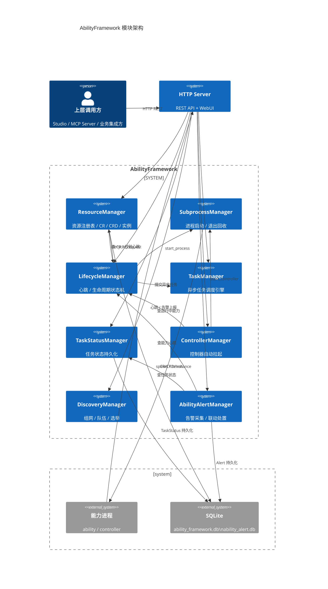
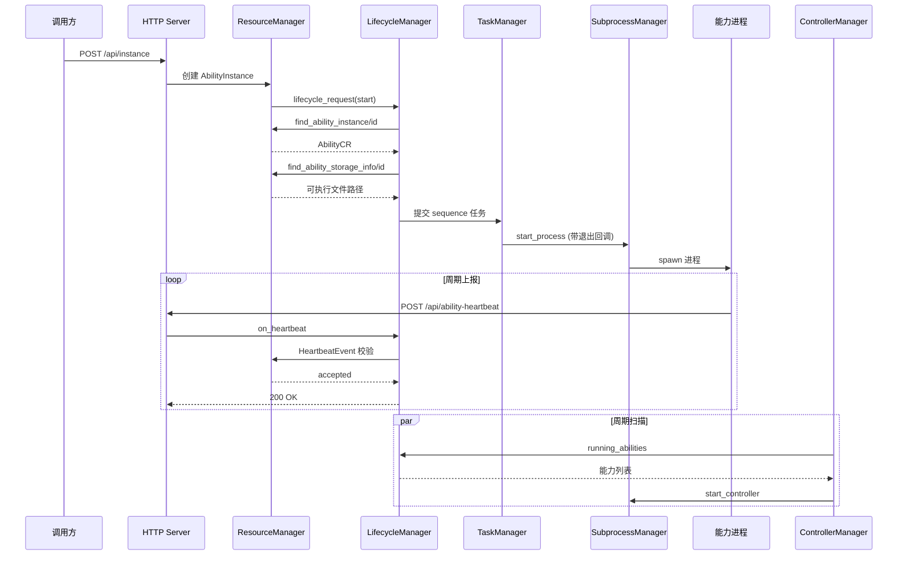

# 总览

AbilityFramework 由若干个解耦的管理器模块组成，模块间通过**消息总线**（同步/异步消息）与 **libuv 事件循环**（定时器、异步任务）协作，并各自向 HTTP 服务器暴露 REST 接口。本文档目录下每个文件介绍一个模块的职责、接口与配置。

## 模块速览

| 模块 | 消息总线名 | 文档 | 一句话职责 |
|---|---|---|---|
| ResourceManager | `ResourceMgr` | [resource_manager.md](/guide/concepts/architecture) | 能力/设备资源的注册表、运行时实例、包仓库与占用关系 |
| SubprocessManager | `SubprocessMgr` | [subprocess_manager.md](/guide/concepts/architecture) | 能力进程与控制器的启动、句柄维护与退出回收 |
| LifecycleManager | `LifecycleMgr` | [lifecycle_manager.md](/guide/concepts/architecture) | 能力心跳维护与生命周期状态机驱动 |
| TaskManager | `TaskMgr` | [task_manager.md](/guide/concepts/architecture) | 基于 C++20 协程的异步任务调度引擎 |
| TaskStatusManager | `TaskStatusMgr` | [task_status_manager.md](/guide/concepts/architecture) | 任务执行状态的持久化与历史查询 |
| ControllerManager | `ControllerMgr` | [controller_manager.md](/guide/concepts/architecture) | 能力控制器的自动发现与拉起 |
| DiscoveryManager | 无 | [discovery_manager.md](/guide/concepts/architecture) | 多节点组网、队伍管理与主从选举 |
| AbilityAlertManager | `AbilityAlertMgr` | [ability_alert_manager.md](/guide/concepts/architecture) | 能力运行时告警的采集、持久化与联动处置 |

## 模块启动顺序

`src/main.cpp` 按以下顺序构造并注册各模块：

```cpp
message_bus::add_modules(
    task_mgr, lifecycle_mgr, resource_mgr,
    subproccess_mgr, task_status_mgr, controller_mgr
);
```

DiscoveryManager 与 AbilityAlertManager 不走消息总线注册，直接构造后绑定 HTTP 接口。

## 模块协作全景

一次"创建并启动一个能力实例"的典型跨模块链路：

### 全局架构 C4 图



### 创建并启动能力实例 - 时序图



相关参考：

- [HTTP API 参考](/api/http-api)
- [配置文件参考](/guide/configuration/config-file)
- [CLI 命令参考](/guide/cli)
