# 能力实例

能力实例是 AbilityFramework 运行时模型的核心。它把"能力模板（CR）"和"正在跑的进程"解耦：模板是静态声明，实例是模板在某个时刻派生出来的、拥有独立 `instance_id` 的运行时对象，退出即销毁。这套设计让框架可以在运行中反复增删实例，而不需要修改模板本身。

简单说：CR 模板像类（class），能力实例像对象（object）。`POST /api/instance` 相当于 `new`，实例退出相当于析构。

## 为什么需要实例这个概念

早期版本里，CR 既是模板也是运行实体——启动一个能力就直接操作 CR 行。这带来三个问题：

1. **单进程重启会污染模板表**：每次启停都在 CR 表上改状态，模板的语义被运行时状态搅在一起。
2. **并发实例无支持**：一个 CR 行只能表示一个运行进程，无法跑同一能力的多个副本。
3. **配置漂移**：实例跑起来后，如果有人改了模板的 spec，正在运行的实例到底按旧 spec 还是新 spec 工作？没有明确答案。

实例化机制用一张独立的 `AbilityInstance` 表解决全部三个问题：模板表只管声明、实例表只管运行、`spec_snapshot` 在创建瞬间冻结配置。

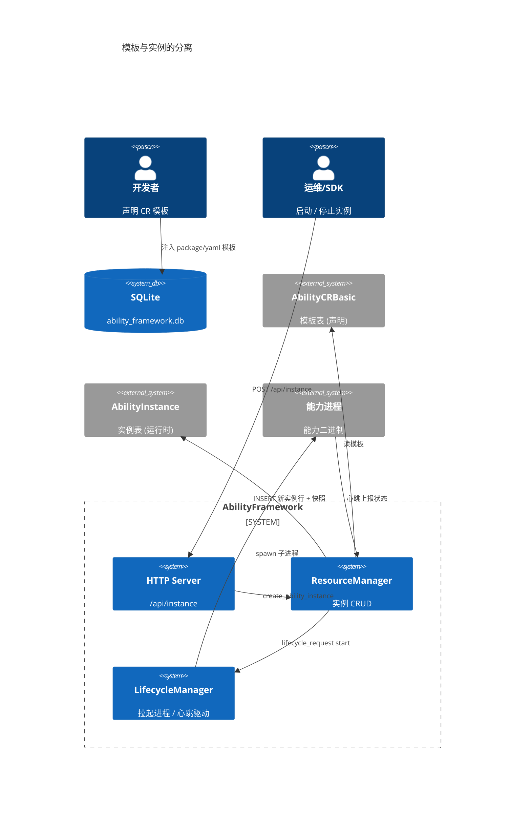

---

## 数据模型

### `AbilityInstance` 表

这是一张纯运行时表，每个正在启动或运行的实例占一行。实例退出后该行立即删除，不保留历史。

| 字段 | 类型 | 说明 |
|---|---|---|
| `instance_id` | TEXT PK | 运行时实例 UUID，由 `create_ability_instance` 生成，**与模板的 `cr_id` 不同** |
| `cr_id` | TEXT | 所属模板（`AbilityCRBasic.instance_id`），N:1 关联 |
| `cr_name` | TEXT | 对应模板的 `metadata.name` |
| `instance_name` | TEXT | 实例显示名，格式 `<cr_name>-<id前8位>` |
| `ability_name` | TEXT | 能力类名称 |
| `ability_version` | TEXT | 能力版本 |
| `pid` | INTEGER | 进程 PID（预留，暂未使用） |
| `state` | TEXT | 生命周期状态，默认 `Inactive` |
| `start_time` | INTEGER | 启动时间（unix 秒） |
| `stop_time` | INTEGER | 停止时间 |
| `spec_snapshot` | TEXT | 启动瞬间的 AbilityCR JSON 快照 |
| `detail` | TEXT | 额外信息 JSON（`abilityPort`、`IPCPort` 等） |

### 模板与实例的关系（ER 图）

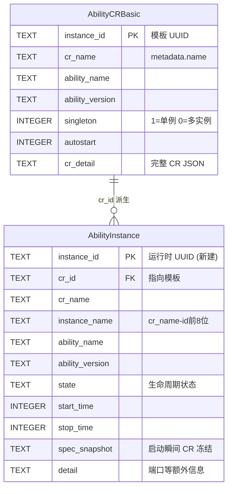

### `spec_snapshot` —— 配置冻结机制

这是实例化设计中最关键的字段。`create_ability_instance` 在创建瞬间做三件事：

1. 复制模板 CR 为 `snapshot`；
2. 把 `snapshot.id` 改成新生成的 `instance_id`（让下游一致）；
3. 把 `lifecycleState` 置为 `Inactive`，序列化成 JSON 存入 `spec_snapshot`。

这样即使模板之后被修改、删除，正在运行的实例仍然按创建那一刻的 spec 工作。`resolve_ability_cr_by_id` 解析时**优先读 `spec_snapshot`**，解析失败才回退到模板表。

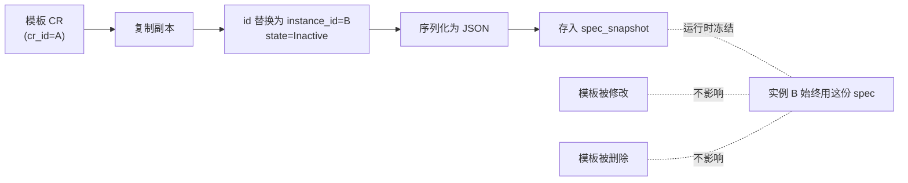

---

## `AbilityInstanceInfo` 结构

ResourceManager 对外暴露的实例元信息结构（`include/resourcemgr/resource_mgr.hpp`）：

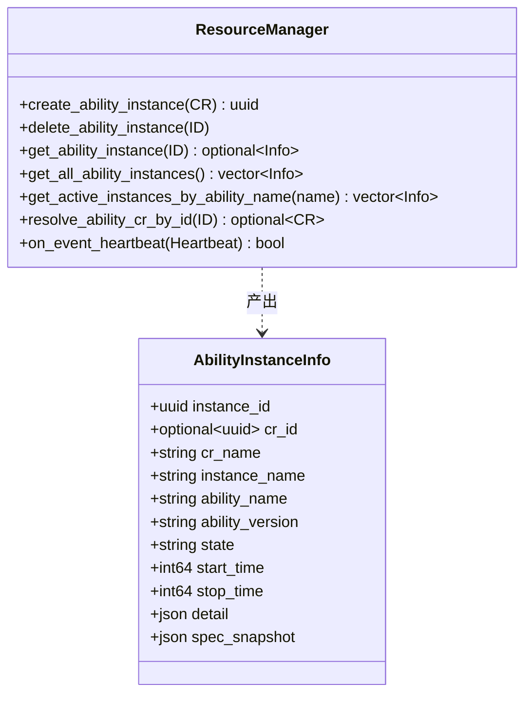

---

## 生命周期状态

实例的 `state` 字段遵循 LifecycleManager 的状态机（见 [生命周期管理器](/guide/concepts/architecture)）。状态枚举定义在 `include/lifecyclemgr/heartbeat.hpp`：

| 状态 | 值 | 含义 |
|---|---|---|
| `Inactive` | 0 | 已创建但未启动 / 已停止 |
| `Init` | 1 | 进程已拉起，正在初始化 |
| `Standby` | 2 | 就绪，IPC 端口已绑定，可接受 connect |
| `Running` | 3 | 正常运行中 |
| `Suspend` | 4 | 挂起 |
| `Terminated` | 5 | 终止（行立即删除） |
| `Error` | 66 | 错误 |
| `Unknown` | 65 | 未知 |

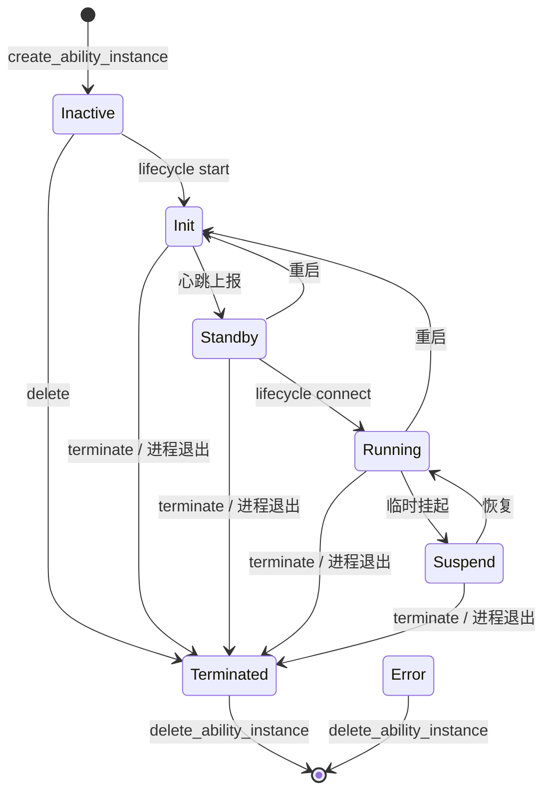

> 关键语义：一旦实例进入 `Terminated`，`on_event_heartbeat` 会立即删除该行。实例表里不存在 `Terminated` 状态的残留行——它只是一个瞬态信号，触发删除。

---

## 创建实例的完整链路

`POST /api/instance` 是最核心的入口。它接收一个模板引用（名字或 UUID），派生实例，然后根据 `start` / `connect` 参数决定拉起多深的任务链。

### 创建时序图

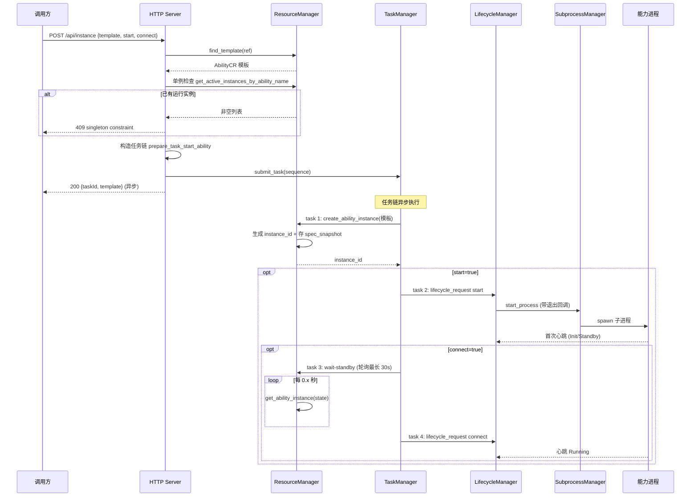

### 任务链的四种变体

`prepare_task_start_ability`（`src/resourcemgr/resource_mgr_http_apis.cpp`）根据参数组合出不同的 `tasks::sequence`：

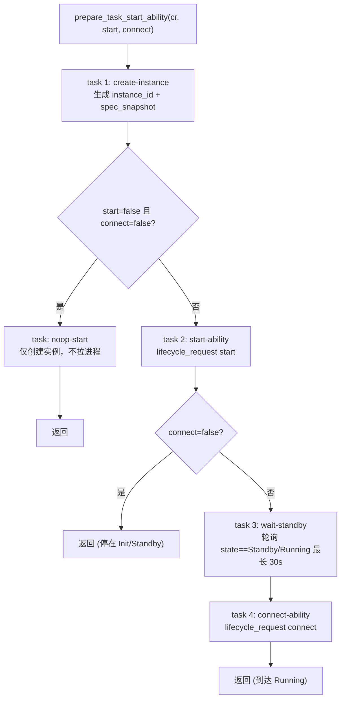

| 调用参数 | 任务链 | 最终状态 |
|---|---|---|
| `start=false, connect=false` | create-instance → noop-start | Inactive（仅创建行） |
| `start=true, connect=false` | create-instance → start-ability | Init 或 Standby |
| `start=true, connect=true` | create-instance → start-ability → wait-standby → connect-ability | Running |
| `start=false, connect=true` | 同上（connect 隐含 start） | Running |

> `connect` 为 true 时强制 `start=true`（代码：`bool start = body.value("start", true); bool connect = start && body.value("connect", true);`）。

---

## 单例约束

当模板的 `spec.singleton` 为 true（缺省值）时，同一能力名全局只允许一个活跃实例。`POST /api/instance` 在创建前会检查：

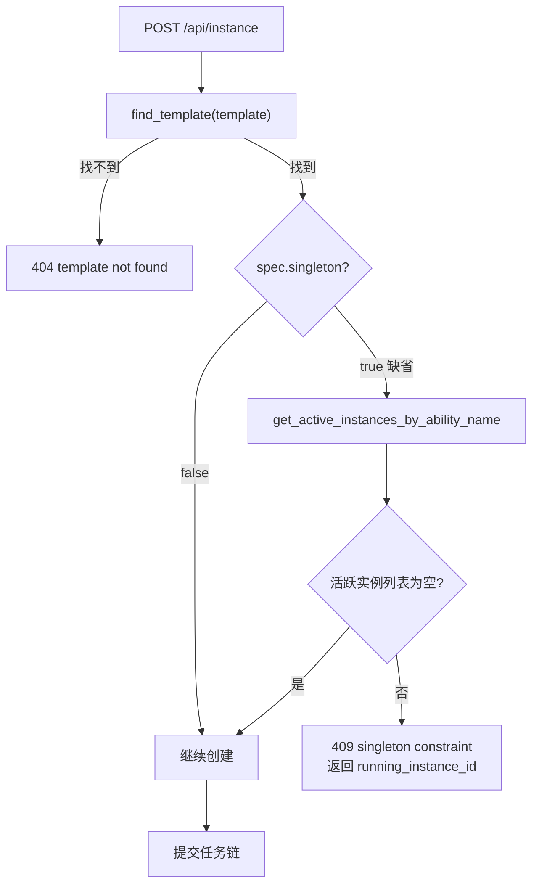

`get_active_instances_by_ability_name` 查询的是 `state NOT IN ('Inactive', 'Terminated')` 的行，即 Init / Standby / Running / Suspend 都算活跃。

---

## use_remote_execution —— 远程执行模式

配置项 `/use_remote_execution`（默认 `false`）控制启动路径。当为 true 时，`POST /api/instance` 跳过 manifest 查找和包下载，直接走 `make_task_start_ability`：

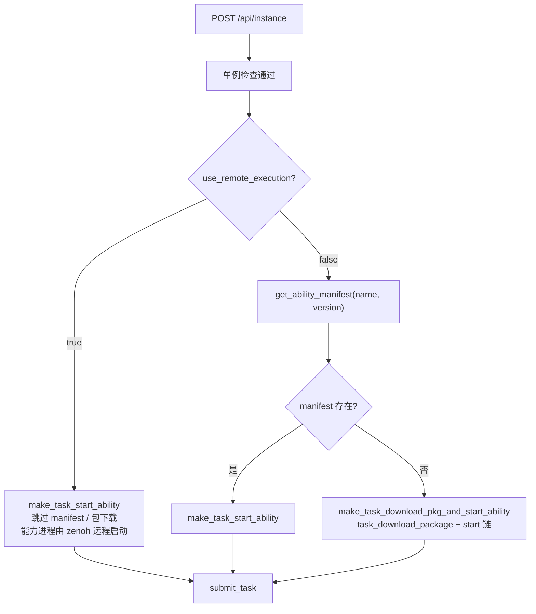

这适用于节点本身没有本地 package 目录的场景——能力进程通过 zenoh 协议在远端节点上启动，本地框架只负责发 lifecycle_request 和维护心跳状态。

---

## 心跳与状态更新

能力进程启动后，通过 `POST /api/ability-heartbeat` 周期性上报 `Heartbeat`（含 `id`、`state`、`abilityPort`、`IPCPort`）。心跳到达后由 LifecycleManager 转发给 ResourceManager 的 `on_event_heartbeat`：

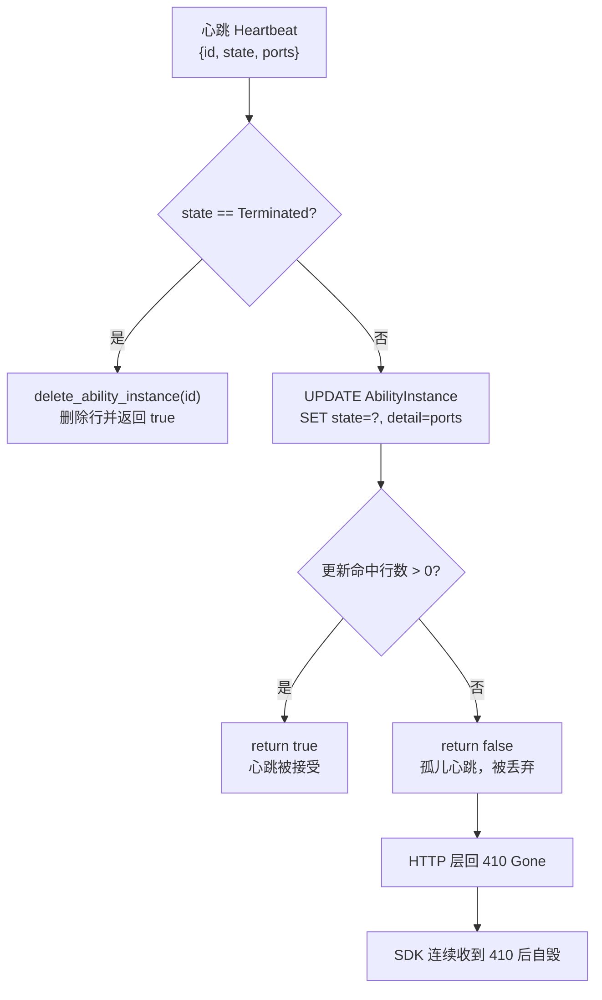

### 孤儿心跳的治理

历史上 `on_event_heartbeat` 在 UPDATE 命中 0 行时会 INSERT 一条"孤儿心跳"占位行。这个 fallback 在框架重启后会产生 **ghost 实例**：上一代被 reparent 到 init 的 python 僵尸进程仍在发心跳，框架给它们造出与任何模板无关、`spec_snapshot` 为 null 的 Running 行，调试非常困难。

现在的修法是**直接丢弃孤儿心跳**，返回 false 让 LifecycleManager 的 HTTP 层回 `410 Gone`，SDK 侧连续收到 410 后会自毁。日志用 `LOG_FIRST_N(WARNING, 20)` 限流，只打前 20 条。

---

## 终止实例

`DELETE /api/instance/:id` 负责销毁实例。它的逻辑是"先尝试优雅终止，再兜底删行"：

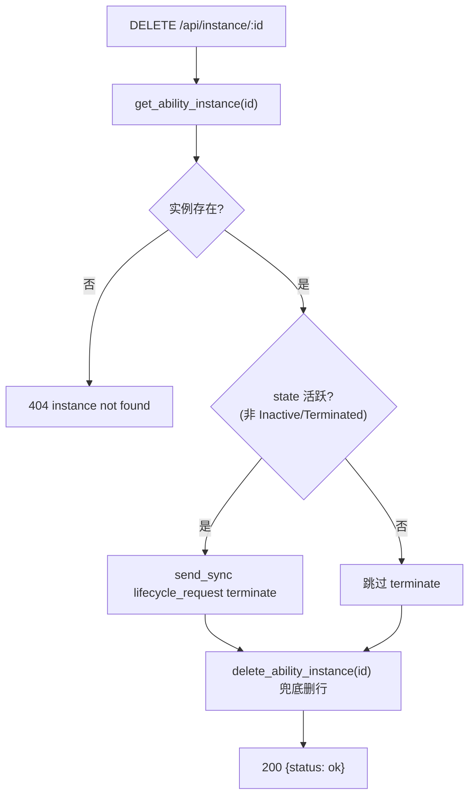

terminate 命令发给 LifecycleManager 后，正常情况下心跳回调或进程退出回调会触发删行。但 `delete_ability_instance` 作为兜底保证即使 lifecycle 没及时回调，行也会被清掉。

---

## 启动时的陈旧实例清理

框架重启后无法验证旧实例是否存活（`PR_SET_PDEATHSIG` + SubprocessManager 已经杀掉了孤儿进程），所以 `ResourceManager::init()` 会把所有非终止状态的行标记为 Terminated：

```sql
UPDATE AbilityInstance
SET state = 'Terminated', stop_time = ?
WHERE state NOT IN ('Terminated', 'Inactive')
```

这一步解决了两个问题：

1. 单例检查 `get_active_instances_by_ability_name` 不会误以为有运行中实例；
2. WebUI 的"运行实例"面板不会显示陈旧的 Running 行。

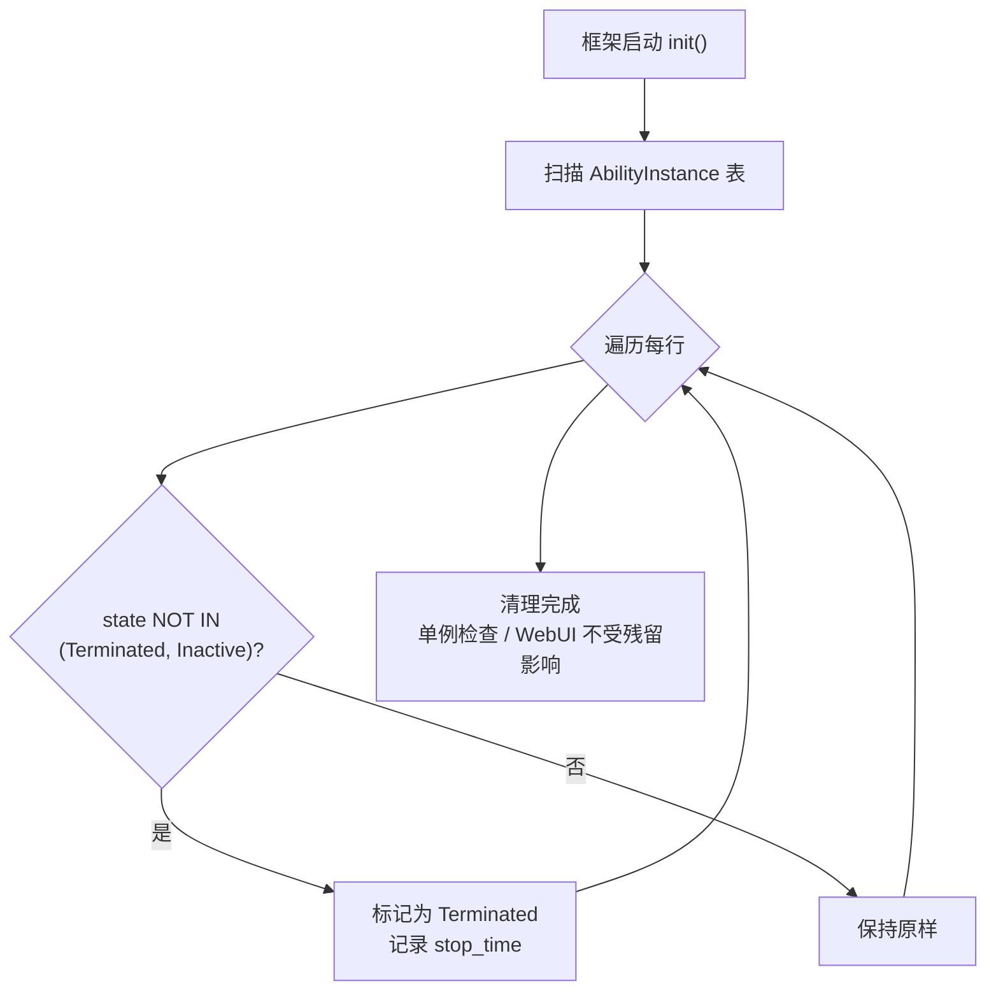

同时还会重置 `AbilityCRBasic.auto_started = 0`，因为 autoStart 的语义是"每次框架启动自动拉起一次"，而不是"CR 整个生命周期只拉起一次"。

---

## autoStart —— 启动时自动拉起

标记了 `autostart = 1` 的 CR 模板会在框架启动时自动派生并启动实例。流程由 `ResourceManager::auto_start_ability()` 驱动：

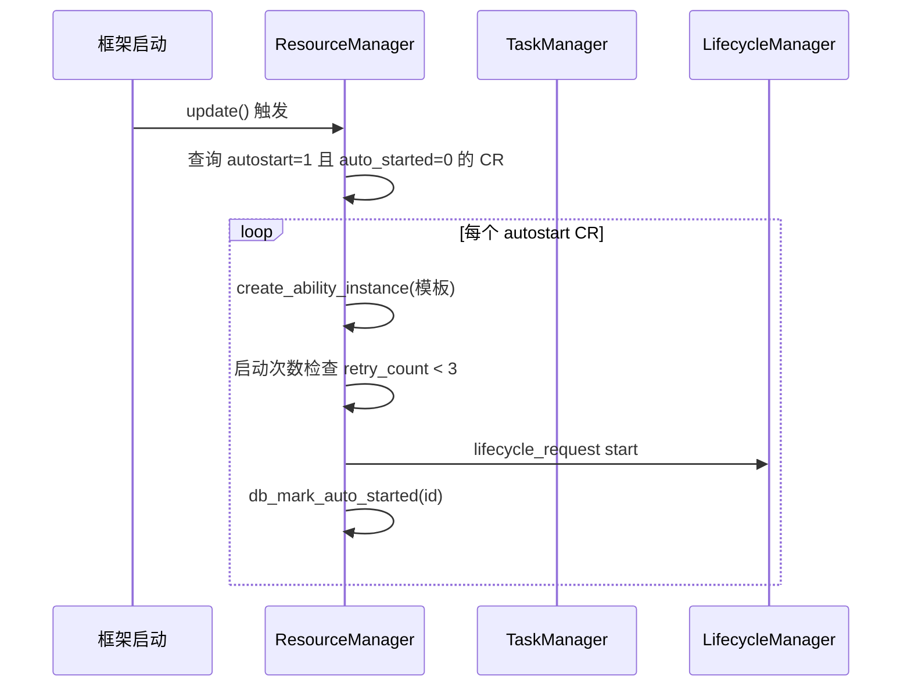

crash 防护由内存中的 `start_records` 提供：同一会话内某个能力的重试次数超过 3 次就不再自动拉起，避免崩溃循环。

---

## HTTP API 速查

| 方法 | 路径 | 说明 | 关键状态码 |
|---|---|---|---|
| GET | `/api/instance` | 列出所有实例 | 200 |
| GET | `/api/instance/:id` | 查询单个实例 | 200 / 404 |
| POST | `/api/instance` | 从模板派生并启动 | 200 / 404 / 409 |
| DELETE | `/api/instance/:id` | 终止并销毁 | 200 / 404 |

### POST 请求体

```json
{
  "template": "my-ability",
  "start": true,
  "connect": true
}
```

- `template`：必填，CR 名字或 UUID。
- `start`：默认 true，是否拉起进程。
- `connect`：默认 true，是否推进到 Running（隐含 start=true）。

### 返回示例

```json
{
  "taskId": "task-uuid",
  "template": "my-ability"
}
```

创建是异步的——任务链提交给 TaskManager 后立即返回 `taskId`，实际启动进度需要轮询实例状态或查询 TaskStatus。

### GET 响应字段

```json
{
  "instance_id": "uuid",
  "cr_id": "模板uuid",
  "cr_name": "my-ability",
  "instance_name": "my-ability-a1b2c3d4",
  "ability_name": "mover",
  "ability_version": "1.0.0",
  "state": "Running",
  "start_time": 1700000000,
  "stop_time": null,
  "detail": {"abilityPort": 8081, "IPCPort": 8082},
  "spec_snapshot": {}
}
```

---

## 相关参考

- [资源管理器](/guide/concepts/architecture)
- [生命周期管理器](/guide/concepts/architecture)
- [任务管理器](/guide/concepts/architecture)
- [HTTP API 参考](/api/http-api)
- [配置文件参考](/guide/configuration/config-file)
- [消息总线](/guide/concepts/architecture)
