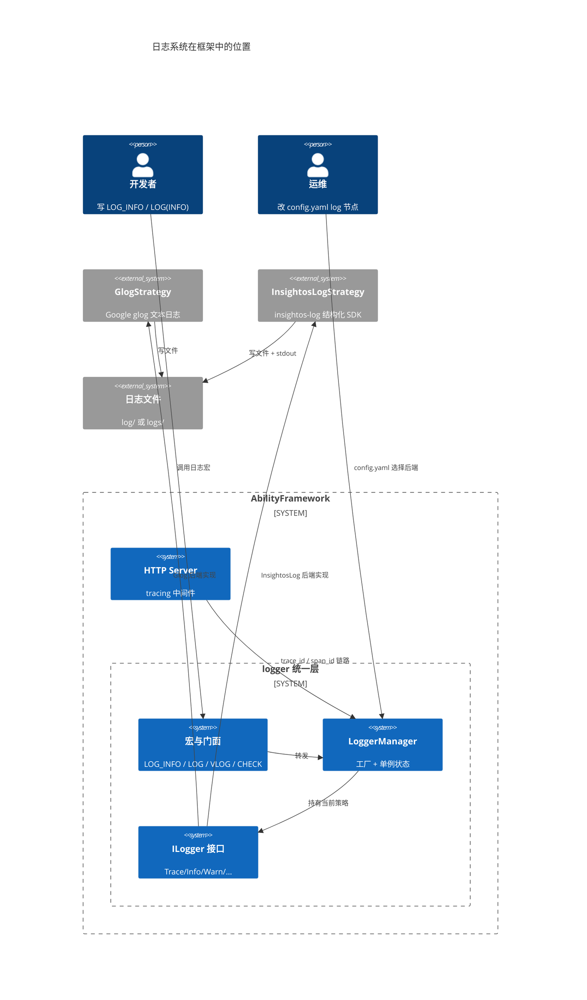
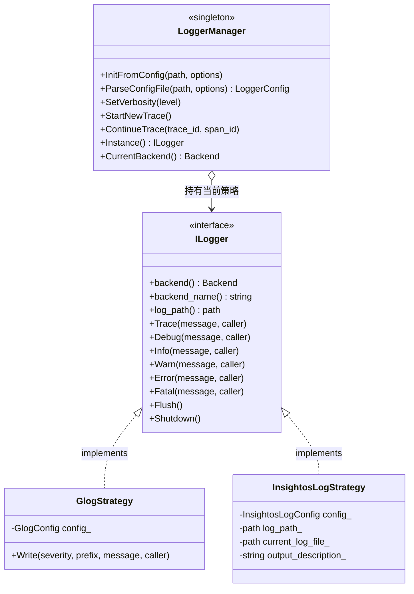
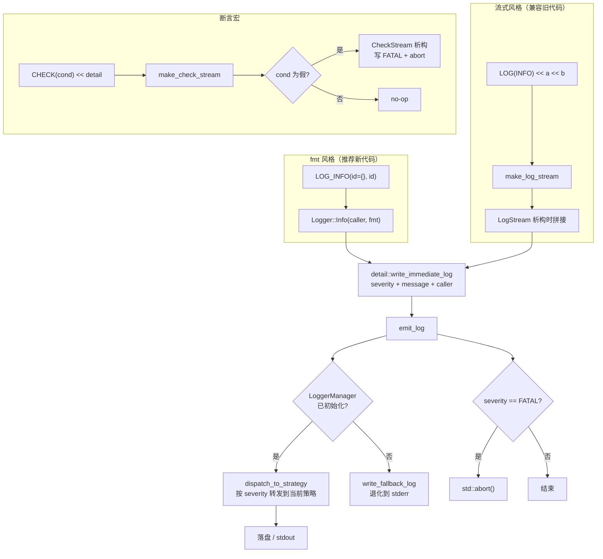
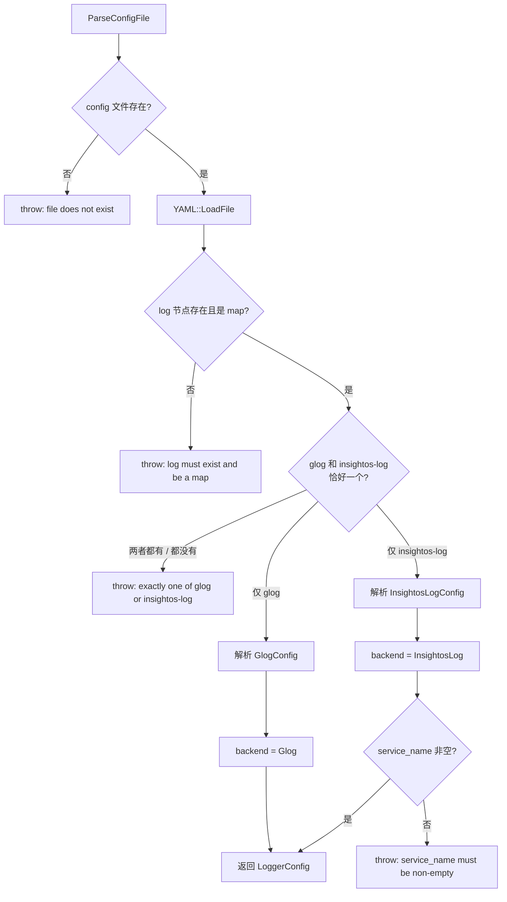
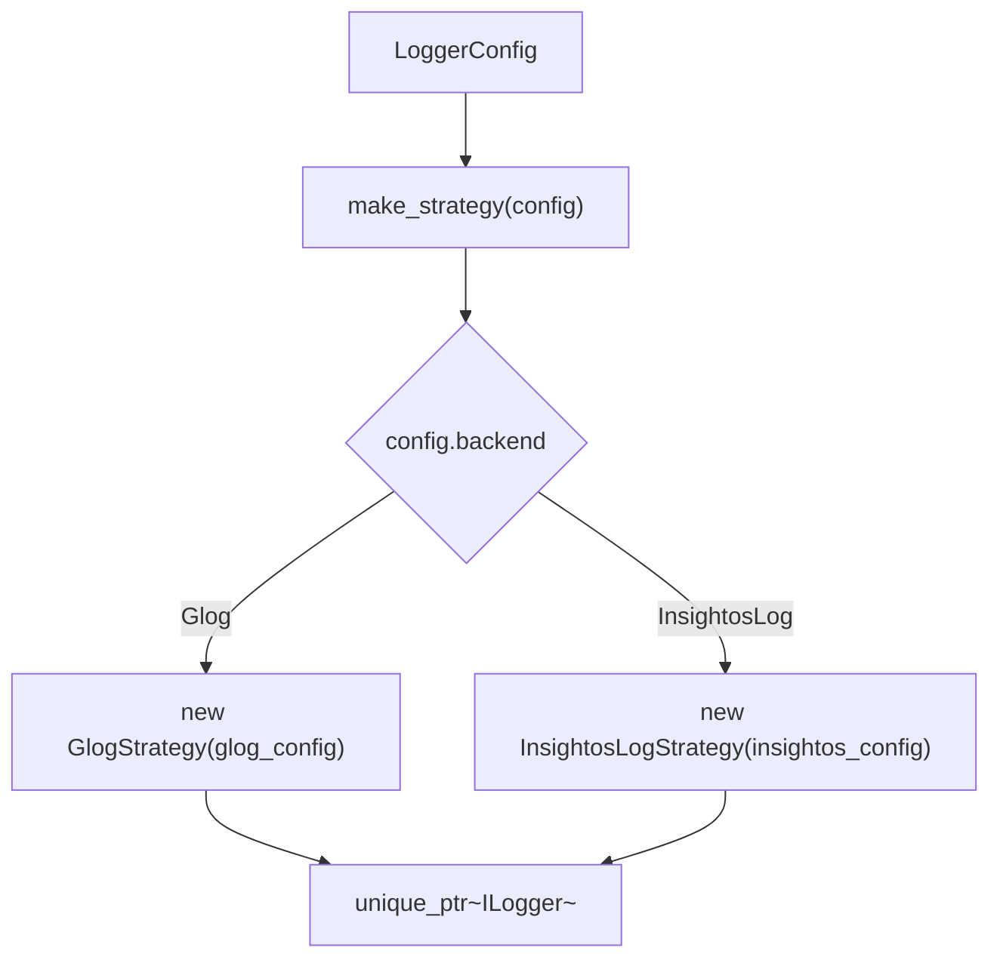
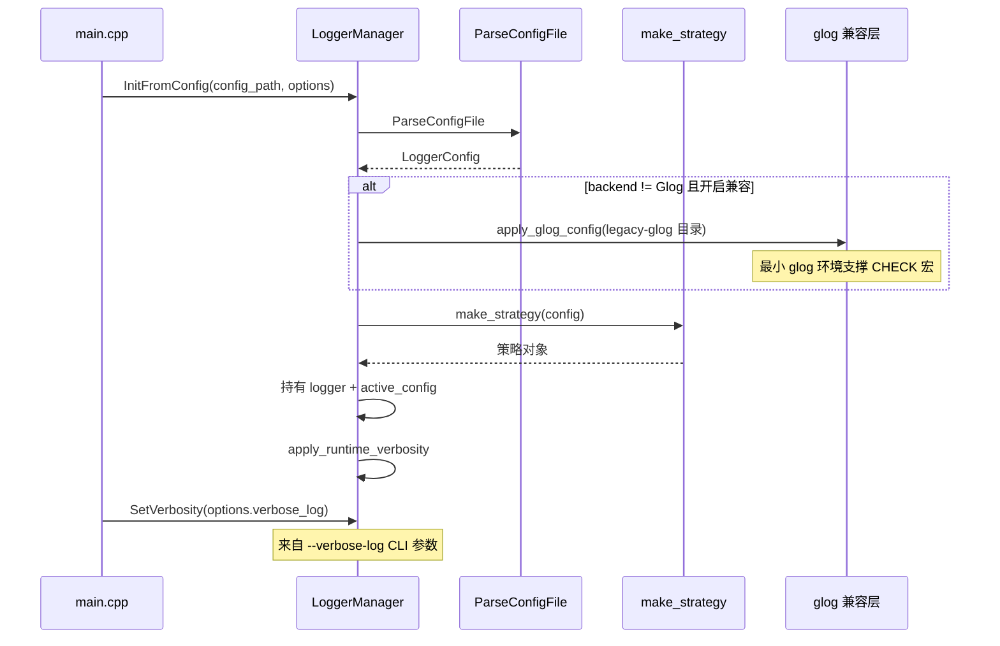
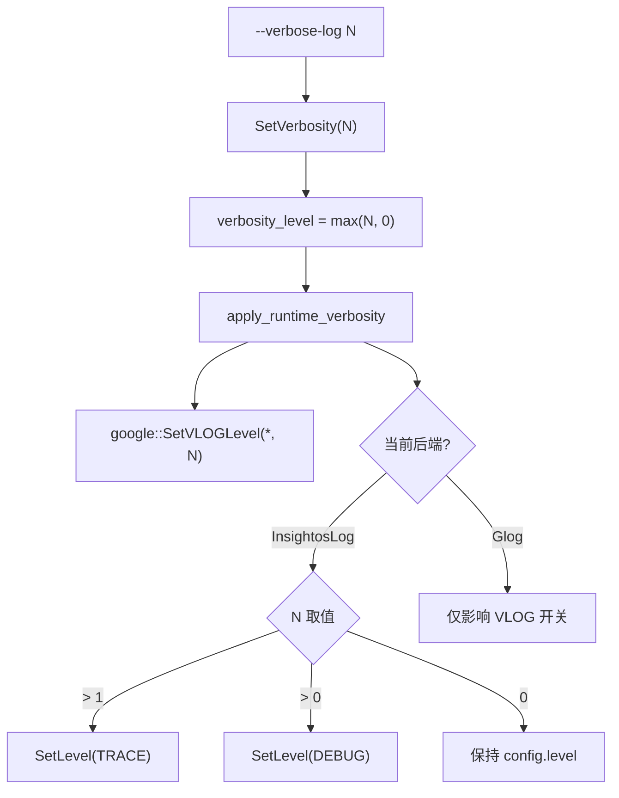
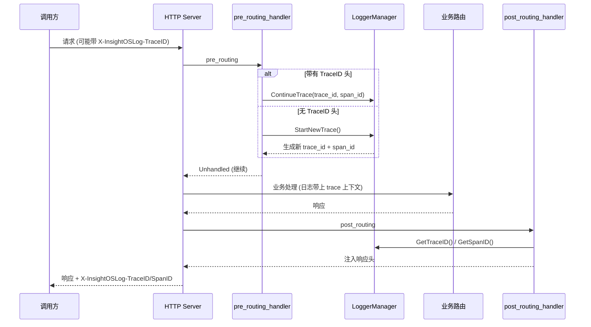
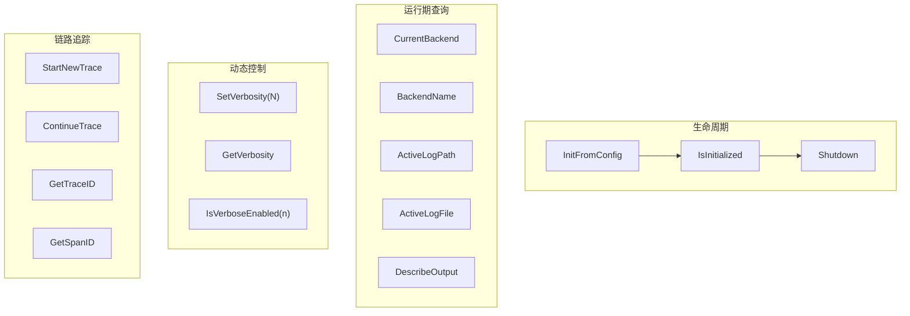

# 日志

::: info
相关配置：`config.yaml` 的 `log` 配置项
:::

日志系统是 AbilityFramework 的基础设施之一。它用一套**统一日志层**屏蔽了底层后端差异，让业务代码不关心当前用的是 Google glog 还是 insightos-log SDK，同时兼容历史遗留的 glog 流式写法和新代码偏好的 fmt 风格。核心设计是**策略模式 + 单例管理器**：一个 `ILogger` 接口、两个实现、一个工厂加状态容器。

## 架构总览



---

## 策略模式与类结构

### 后端选择

`logger::Backend` 枚举只暴露后端种类，不绑死具体三方库类型，这样新增第三种日志实现时调用方和大部分初始化逻辑都不用改。

| 后端 | 策略类 | 特点 |
|---|---|---|
| `Glog` | `GlogStrategy` | 进程级文本日志器，兼容历史 glog 调用 |
| `InsightosLog` | `InsightosLogStrategy` | 结构化日志 SDK，支持 service 元数据、链路追踪 |



### 两种后端为什么不能揉成一套字段

glog 和 insightos-log 的模型并不对齐：glog 更像"进程级文本日志器"，insightos-log 是"结构化日志 SDK"。所以配置先拆开建模（`GlogConfig` 与 `InsightosLogConfig`），再通过 `LoggerConfig` 做互斥选择，避免把两个后端硬揉成一套字段。`LoggerManager` 只需持有"当前选中的后端 + 该后端配置"这一个决策结果，就能在运行时重建或切换策略对象。

---

## 三种调用风格

业务代码不论用哪种风格，最终都走同一条策略分发路径（`detail::write_immediate_log`）。



### 风格一：fmt 格式化宏（推荐）

新代码优先使用 fmt 风格，避免继续堆 `<<`：

```cpp
LOG_TRACE("trace detail {}", ctx);
LOG_DEBUG("debug id={}", id);
LOG_INFO("server started on {}:{}", ip, port);
LOG_WARN("retry {}/{}", attempt, max);
LOG_ERROR("failed to parse {}", path);
LOG_FATAL("unreachable");
```

宏在展开时通过 `__FILE__` / `__LINE__` / `__PRETTY_FUNCTION__` 采集调用点信息，再交给 `Logger` 门面格式化并下发。这样两个后端都能拿到统一的 caller 元数据，日志检索时定位成本更低。

### 风格二：流式宏（兼容 glog 写法）

旧代码大量使用 `LOG(INFO) << a << b`。全量手改成 fmt 风格迁移成本高、出错点多，所以统一层用 `LogStream` 这个临时流对象先把文本拼出来，在析构时再统一提交，实现"调用形态兼容、后端实现统一"：

```cpp
LOG(INFO) << "create ability instance " << id << " from " << name;
LOG(WARNING) << "dropping orphan heartbeat from " << id_str;
```

`VLOG(n)` 映射到 `StreamSeverity::DEBUG`，由 `LoggerManager::IsVerboseEnabled(n)` 决定是否启用。`LOG_IF(level, cond)`、`LOG_FIRST_N(level, count)`、`DLOG(level)` 同样重定向到统一层。

### 风格三：CHECK 断言

`CheckStream` 复用"析构提交"原理，但只在断言失败时输出日志并终止进程，不依赖特定 glog 发行版是否提供完整 CHECK 宏族：

```cpp
CHECK(ptr != nullptr);
CHECK_NOTNULL(ptr);
CHECK_EQ(a, b) << "a must equal b";
CHECK_NE(a, b);
CHECK_GE(version, 2);
```

即使业务日志切到 insightos-log，框架仍会以兼容模式初始化一个最小 glog 环境（日志写入 `<home>/log/legacy-glog`），专门支撑 `CHECK` 等断言宏。

---

## 配置解析

`LoggerManager::ParseConfigFile` 读取 config.yaml 的 `log` 节点，做互斥校验后产出 `LoggerConfig`。

### 互斥校验

`log` 是一个 map，**必须且只能**包含 `glog` 或 `insightos-log` 其中的一个。两者同时存在或同时缺失都会抛异常导致启动失败。



### 路径解析

相对路径基于 workspace_root 解析（即 `ABILITY_FRAMEWORK_HOME` 或进程工作目录）。insightos-log 的 `log_root` 为空时退化为 `$HOME/insightoslog`，`$HOME` 不存在则为 `/tmp/insightoslog`。实际落地目录还会拼上 `service_name` 和 `instance_id`。

### 后端选择流程



### 配置示例

glog 后端：

```yaml
log:
  glog:
    color_log: true
    also_log_to_stderr: false
    max_log_size: 1024
    stop_logging_if_full_disk: true
    log_dir: log
```

insightos-log 后端（config.yaml 中的默认配置）：

```yaml
log:
  insightos-log:
    level: INFO
    service_type: ability
    service_name: AbilityFramework
    instance_id: af
    output: dual
    log_root: logs
    buffer_size: 8192
    flush_interval: 2
    enable_tracing: true
    file:
      max_size: 1048576
      max_files: 3
```

完整字段说明见 [配置文件参考 - log 节点](/guide/configuration/config-file#log--日志配置)。

---

## 初始化流程

日志系统在 `src/main.cpp` 中**最早**初始化，早于模块构造和数据库初始化。如果这里不先决定后端，运行期就会出现"有些日志走 glog，有些日志走新接口"的分裂状态。



### `LoggerInitOptions`

初始化时叠加的运行期选项：

| 字段 | 默认值 | 说明 |
|---|---|---|
| `workspace_root` | 空 | 解析相对路径的基准目录 |
| `force_console_output` | false | 对应命令行 `--log-to-stdout`，强制控制台输出 |
| `enable_legacy_glog_compatibility` | true | 迁移期保留 CHECK/旧宏的最小 glog 环境 |

---

## Verbosity 控制

`--verbose-log N` CLI 参数通过 `LoggerManager::SetVerbosity(N)` 生效。它同时影响两个层面：

1. `VLOG(n)` 的开关：`IsVerboseEnabled(n)` 判断 `n <= verbosity_level`；
2. glog 的 `SetVLOGLevel("*", N)`；
3. insightos-log 后端的 SDK 最小级别（verbosity > 1 下调到 TRACE，> 0 下调到 DEBUG）。



---

## 链路追踪（Tracing）

当后端为 insightos-log 且 `enable_tracing: true` 时，框架会为每个 HTTP 请求维护一条 trace 链路，通过响应头把 `trace_id` / `span_id` 回传给调用方。所有 trace 方法在后端为 Glog 时都是空操作，调用方无需额外判断后端类型。

### HTTP 中间件

`src/main.cpp` 注册了两个中间件：

- `set_pre_routing_handler`（请求入口）：检查 `X-InsightOSLog-TraceID` 头，有则继续链路，无则开启新链路；
- `set_post_routing_handler`（响应出口）：把当前 `trace_id` 和 `span_id` 写入响应头。



### trace 方法清单

| 方法 | 说明 | Glog 后端行为 |
|---|---|---|
| `StartNewTrace()` | 为当前线程开启一条新追踪链路 | 空操作 |
| `ContinueTrace(trace_id, span_id)` | 续接已有链路 | 空操作 |
| `GenerateSpanID()` | 生成新的 span id | 返回空串 |
| `GetTraceID()` | 获取当前 trace id | 返回空串 |
| `GetSpanID()` | 获取当前 span id | 返回空串 |

调用方拿到响应头里的 trace_id 后，可以在日志系统中串联同一次请求的全部日志，形成完整的调用链视图。

---

## 环境变量联动

| 环境变量 | 说明 |
|---|---|
| `ABILITY_FRAMEWORK_HOME` | 框架工作主目录，日志相对路径基于它解析 |
| `LOG_LEVEL` | 使用 insightos-log 后端时自动设置并注入子进程，保证子进程日志级别与主进程一致 |
| `HOME` | insightos-log 的 `log_root` 为空时回退基准目录 |

`--log-to-stdout` 命令行参数会强制 `force_console_output = true`：glog 后端开启 `also_log_to_stderr`，insightos-log 后端若配置为 `rotate_file` 则改为 `dual`。

---

## 运行期控制接口



`LoggerManager` 本质上是一个工厂 + 单例状态容器：解析配置并校验互斥关系、创建并持有当前策略对象、对外暴露当前后端、输出路径、verbosity 等运行期信息。所有静态方法都通过内部的 `LoggerState`（互斥锁保护的 `unique_ptr<ILogger>` + `LoggerConfig` + atomic verbosity）实现线程安全。

### FATAL 语义

`emit_log` 在日志落盘后，若 severity 为 `FATAL` 会调用 `std::abort()` 终止进程，保持 glog 时代的"致命日志即终止"语义。`CHECK` 断言失败也走这条路径。

---

## 相关参考

- [配置文件参考](/guide/configuration/config-file)
- [CLI 命令参考](/guide/cli)
- [Skill 技能文档系统](/guide/release-highlights/skill)
- [能力实例](/guide/release-highlights/instance)
