# Skill 

Skill 是 AbilityFramework 引入的**核心新功能**。它让能力包（ability package）可以携带面向 AI Agent 的**技能说明文档**，在安装时被框架镜像到一个固定位置，再通过 HTTP API 暴露给 WebUI、MCP Server 与上层业务集成方。它的目标是用最小侵入的方式，把"能力包如何被 LLM 调用"这件事变成框架一等公民。


::: info 
能力包作者在 zip 里放一个 `skills/` 目录，框架自动把它托管起来，Agent 就能发现并读取这些说明。
:::


## 它解决什么问题

在没有 Skill 之前，能力包只能描述自己的**运行时模型**（CR/CRD：能力有哪些参数、返回什么字段），但无法描述**如何被 LLM 调用**——比如"先调哪个 API、参数怎么填、典型 prompt 长什么样"。这些知识散落在各种 wiki、README、甚至口头约定里。

Skill 把这类知识变成了**随包发布的文档资产**：包作者写一次，框架统一托管，所有消费者（WebUI、MCP Server、Agent）从同一个固定位置发现，不需要各自维护副本。

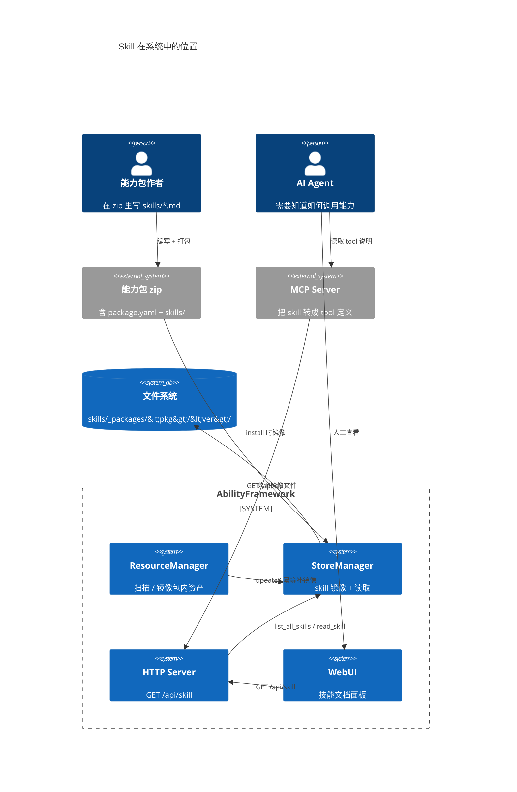

---

## 核心概念

| 概念 | 说明 |
|---|---|
| **Skill 文件** | 一个文本文件（markdown / txt / json 等任意扩展名），描述某项可被 Agent 调用的能力用法 |
| **包内嵌 skill** | 能力包 zip 里 `skills/` 子目录下的文件，随包发布 |
| **镜像（mirror）** | 安装时把 `skills/**` 递归拷贝到 `<framework_home>/skills/_packages/<pkg>/<version>/` |
| **SkillEntry** | 单个 skill 的元数据：包名、版本、文件名、大小、标题 |
| **消费者** | WebUI（人工查看）、MCP Server（转成 tool 定义）、上层 Agent（决策如何调用） |

关键设计取舍：**Skill 不进数据库、不参与 reconcile、不限制扩展名**。它是纯粹的"打包文档资产"，生命周期完全跟随能力包的安装与卸载，由文件系统托管。

---

## Skill 与能力包的关系

Skill 是能力包的一个**可选子资产**。一个包的结构长这样：

```
my-ability-pkg/
├── package.yaml          # 必需：包元数据（name/version/arch）
├── bin/                  # 能力可执行文件
├── crs/                  # 可选：包内嵌 CR 模板（*.yaml）
├── abilities/            # 能力/设备 CRD 定义
└── skills/               # 可选：包内嵌 skill 文档 ★新增
    ├── SKILL.md          # 主技能说明
    └── tasks/
        ├── move.md       # 子任务说明（支持多级目录）
        └── grasp.md
```

`skills/` 目录可以是任意深度、任意扩展名。框架在镜像时递归保留目录结构，读取时也按相对路径定位。

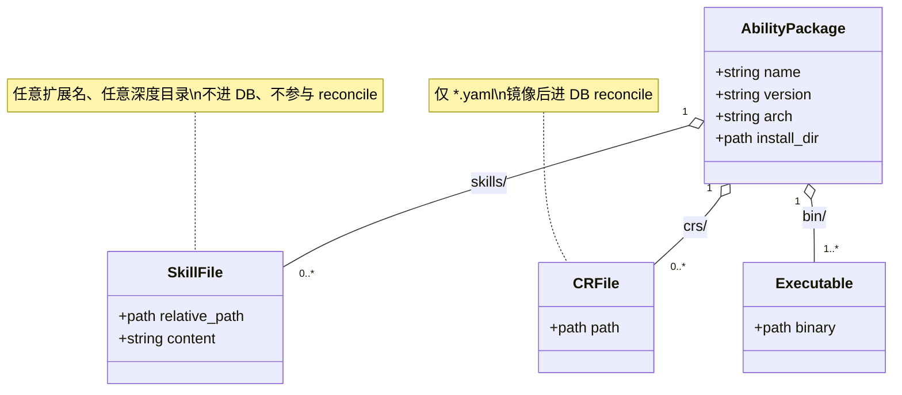

Skill 与 CR 都是"包内嵌资产"，但定位完全不同，下文有专门对比。

---

## 镜像机制

### 镜像目录布局

框架把所有包的 skill 统一镜像到 `$ABILITY_FRAMEWORK_HOME/skills/_packages/` 下，按 `<包名>/<版本>` 分层，内部保留原目录结构：

```
$ABILITY_FRAMEWORK_HOME/
└── skills/
    └── _packages/
        ├── mover/                       # 包名
        │   ├── 1.0.0/                   # 版本
        │   │   ├── SKILL.md
        │   │   └── tasks/
        │   │       └── move.md
        │   └── 1.1.0/
        │       └── SKILL.md
        └── gripper/
            └── 2.0.0/
                └── SKILL.md
```

这个布局是**机器可枚举**的：`list_all_skills()` 先扫两层目录（包/版本），再在每个版本目录里递归抓所有普通文件。消费者不需要知道包是怎么装的，只从这个固定根目录读。

### 镜像数据流

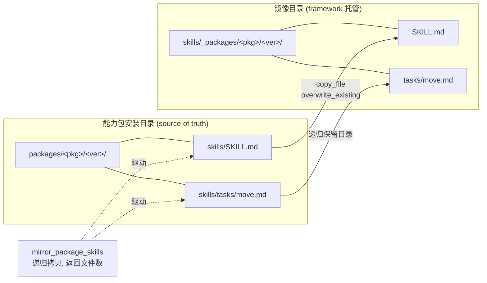

### 三个镜像触发点

镜像发生在能力包生命周期中的**三处**，保证无论包是怎么进来的，skill 最终都会落地：

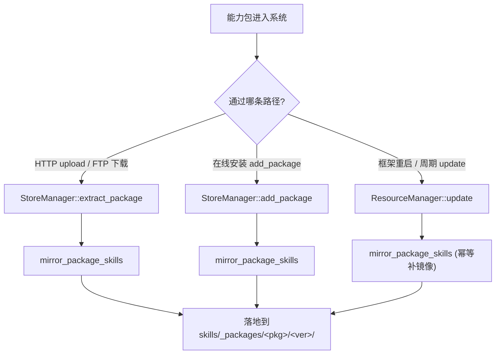

| 触发点 | 函数 | 场景 | 是否幂等 |
|---|---|---|---|
| 解压安装 | `extract_package` | HTTP/FTP 上传的 zip | 是（overwrite_existing） |
| 在线安装 | `add_package` | `POST /api/package` 在线安装 | 是 |
| 周期更新 | `ResourceManager::update` | 框架启动 + 定时器，对所有已存在包补镜像 | 是 |

> `update()` 里的镜像调用是**关键的兜底设计**：注释明确写到"install 路径已经在 add_package / extract_package 里调过，但对于 framework 启动时已经存在的旧包（没走过 install 路径），这里补一次，让 packages 目录是 source of truth"。这意味着即使你手动把包拷进 `packages/` 目录，下次 update 也会自动镜像它的 skill。

### 镜像函数细节

`mirror_package_skills` 的行为：

1. 检查 `<pkg_install_dir>/skills` 是否存在且是目录，不存在直接返回 0
2. 创建目标镜像目录
3. 用 `recursive_directory_iterator` 遍历 `skills/` 下所有文件
4. 对每个普通文件，保留相对路径，`copy_file` 并覆盖已有文件
5. 单个文件拷贝失败只记 WARNING 并继续（不中断整体），返回成功拷贝数

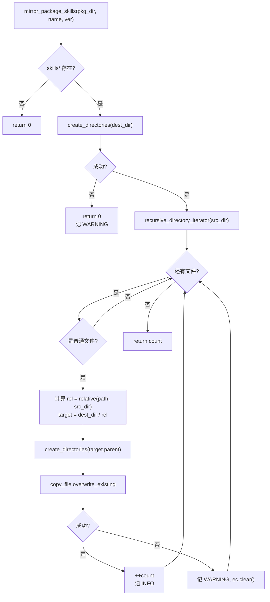

---

## 卸载与清理

卸载能力包时，镜像的 skill 会被同步移除。`unmirror_package_skills` 接受可选版本号：传具体版本只删该版本，传空串则删该包的所有版本。

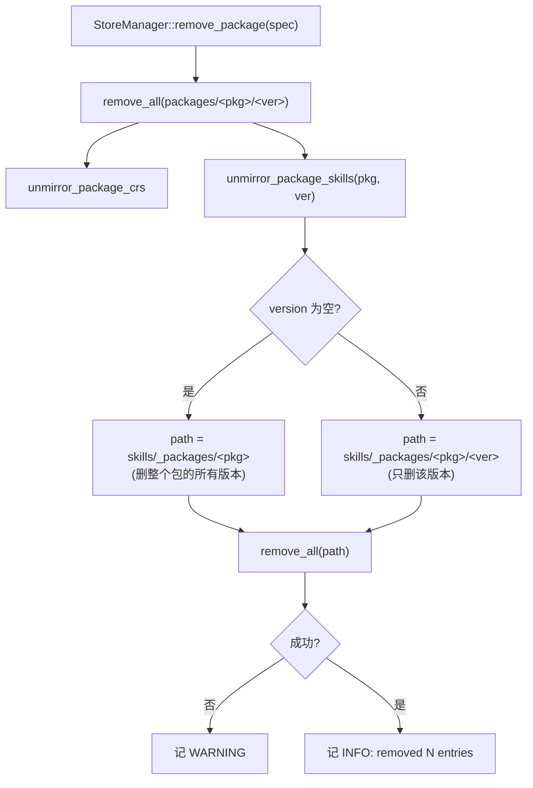

清理与镜像严格对称：镜像时落了什么，卸载时就删什么，不会留下孤儿文档。

---

## Skill 生命周期

一个 skill 文件从编写到消失的完整状态流转：

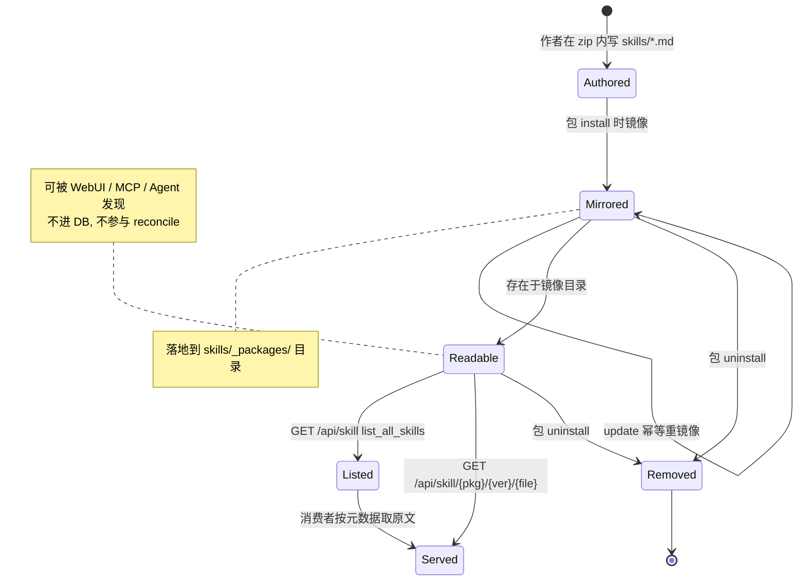

---

## 安装时序

一次完整的"上传带 skill 的能力包 → 镜像 → 可被读取"链路：

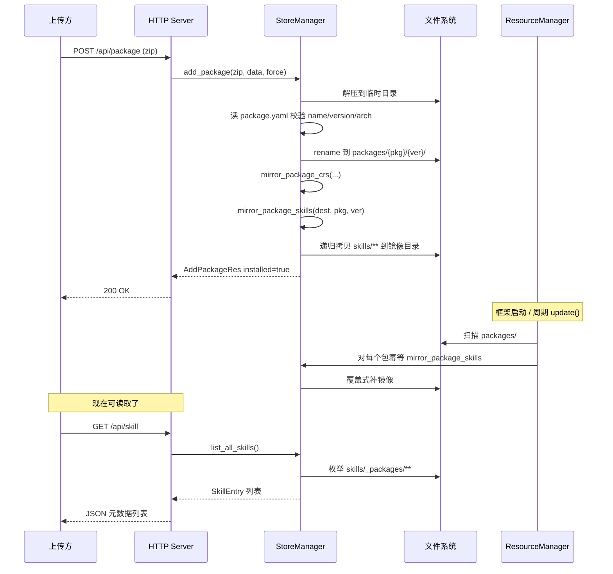

---

## HTTP API

Skill 通过两个 GET 端点暴露，都在 `resource_mgr_http_apis.cpp` 注册。

### `GET /api/skill` — 列出全部 skill 元数据

返回一个 JSON 数组，每项是一个 `SkillEntry`。遍历 `skills/_packages/` 下所有包/版本，递归抓文件。

响应示例：

```json
[
  {
    "package": "mover",
    "version": "1.0.0",
    "filename": "SKILL.md",
    "size": 1234,
    "title": "移动能力使用指南"
  },
  {
    "package": "mover",
    "version": "1.0.0",
    "filename": "tasks/move.md",
    "size": 567,
    "title": "直线移动任务"
  }
]
```

### `GET /api/skill/:package/:version/*filename` — 读单个 skill 原文

用通配正则 `([^/]+)/([^/]+)/(.+)` 捕获包名、版本、文件名（文件名可含子目录，如 `tasks/move.md`）。返回 `text/markdown; charset=utf-8` 原文。找不到返回 404 + JSON 错误体。

```
GET /api/skill/mover/1.0.0/SKILL.md           → 200 text/markdown
GET /api/skill/mover/1.0.0/tasks/move.md      → 200 text/markdown
GET /api/skill/mover/1.0.0/nope.md            → 404 {"error":"skill not found",...}
GET /api/skill/mover/1.0.0/../../etc/passwd   → 404 (路径穿越被拦截)
```

### API 与 StoreManager 的调用关系

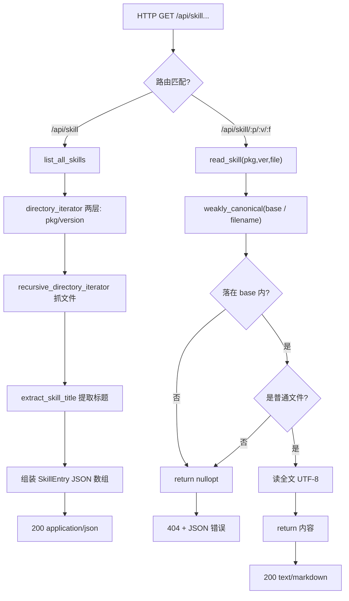

---

## 路径穿越防护

`read_skill` 有显式的 path traversal 守卫。因为 filename 来自外部 HTTP 输入，必须防止 `../../etc/passwd` 这类攻击把任意文件读出去。

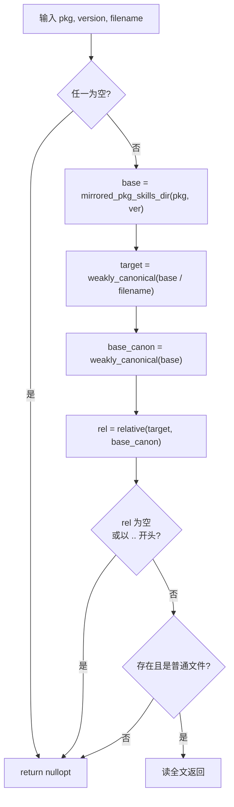

只有解析后的规范路径**严格落在镜像目录之内**，才允许读取。即使包名/版本里塞了 `..`，也会被 canonical 化后拦截。

---

## 标题提取

`list_all_skills` 返回的 `title` 字段由 `extract_skill_title` 生成，它尝试从 skill 文件前 60 行抓一个可读标题，让消费者不用读全文也能展示。提取顺序：

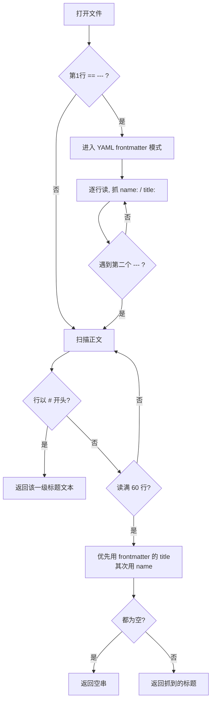

也就是说，优先级是：**正文的第一个 `#` 标题 > frontmatter 的 `title:` > frontmatter 的 `name:` > 空串**。值会去掉首尾空白和包围引号。这覆盖了两种主流的 markdown skill 写法（带 frontmatter 和不带）。

---

## StoreManager 的 Skill 接口

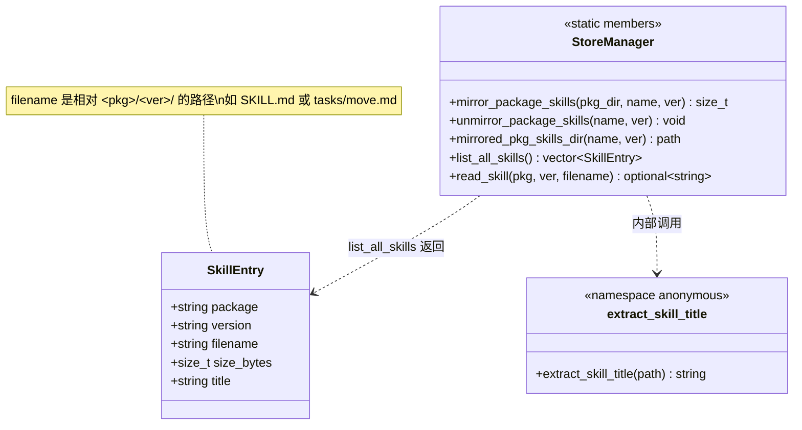

| 方法 | 用途 | 调用方 |
|---|---|---|
| `mirror_package_skills` | 递归拷贝 skills/ 到镜像目录 | extract / add / update |
| `unmirror_package_skills` | 删镜像（支持只删某版本） | remove_package |
| `mirrored_pkg_skills_dir` | 计算固定镜像路径 | 内部 / 诊断 / 测试 |
| `list_all_skills` | 枚举全部 skill 元数据 | `GET /api/skill` |
| `read_skill` | 读单个 skill 原文（带穿越防护） | `GET /api/skill/:p/:v/:f` |

---

## Skill vs CR 镜像

Skill 镜像和 CR 镜像是**同构**设计（同样的 mirror/unmirror/mirrored_dir 三件套，同样的三处触发点），但语义截然不同。理解这对兄弟，能快速掌握框架处理"包内嵌资产"的整体思路。

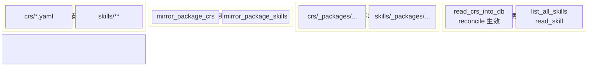

| 维度 | CR 镜像 | Skill 镜像 |
|---|---|---|
| 扩展名 | 仅 `*.yaml` | 任意（md/txt/json/...） |
| 是否进 DB | 是，`read_crs_into_db` 解析入库 | 否，纯文件资产 |
| 是否参与 reconcile | 是，`update()` 会保留/删除 CR 行 | 否，与运行时模型无关 |
| 目录层级 | `crs/_packages/<pkg>/<ver>/` | `skills/_packages/<pkg>/<ver>/` |
| 消费方式 | 进程内 DB 查询 | HTTP API + 文件读 |
| 定位 | 运行时模型（能力参数/返回） | Agent 文档（如何调用） |

一句话：CR 描述"能力长什么样"，Skill 描述"能力怎么用"。前者是给框架和调度器看的，后者是给 LLM 看的。

---

## 消费者视角

### WebUI

WebUI 有专门的"技能文档"面板（`panel-skills`），用表格列出所有 skill（包、版本、文件、标题、大小），点"查看"读原文。

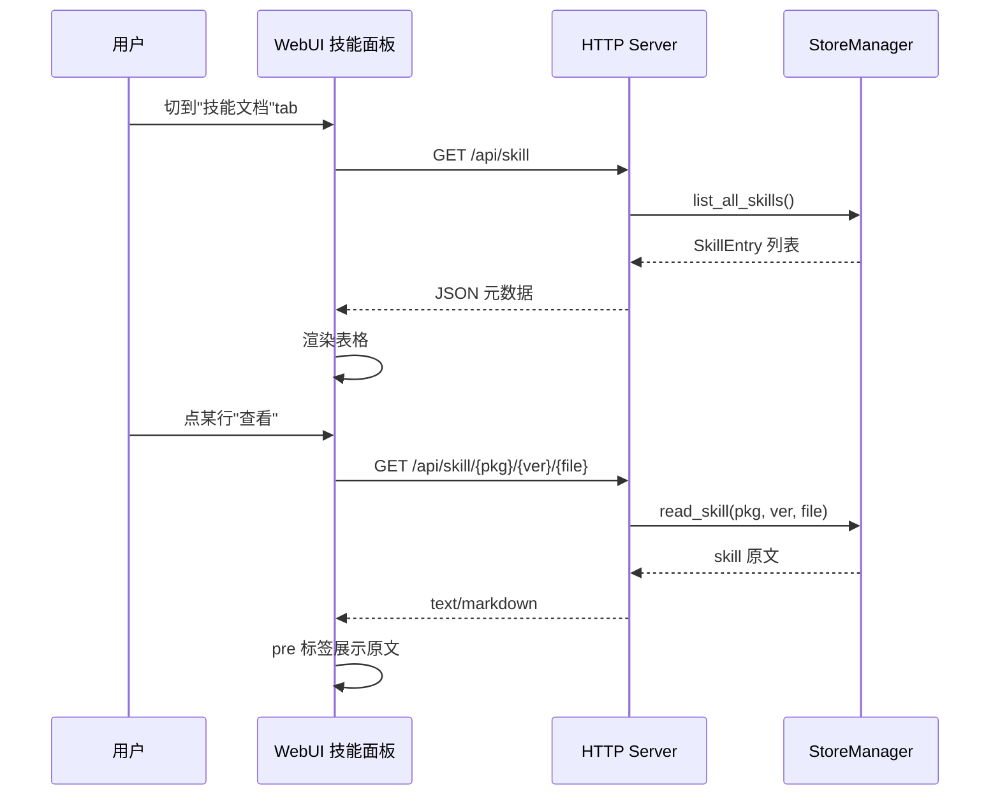

### MCP Server / Agent

MCP Server 是 skill 的主要自动化消费者：它把 skill 文档转成 LLM 可理解的 tool 定义，Agent 据此决定何时、如何调用对应能力。

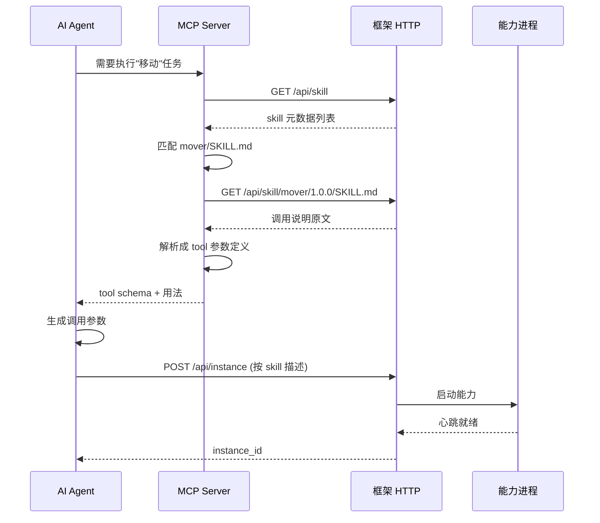

### 人工 vs 自动化发现对比

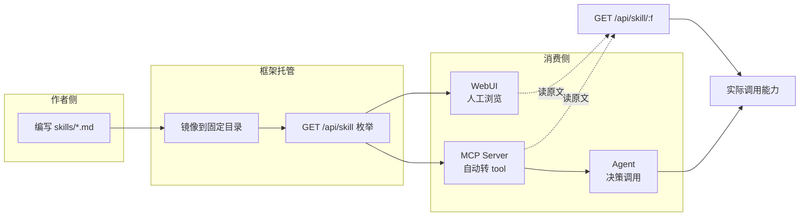

---

## 完整生命周期总览

把所有环节串起来，一个 skill 文档从无到有再到消失的端到端流程：

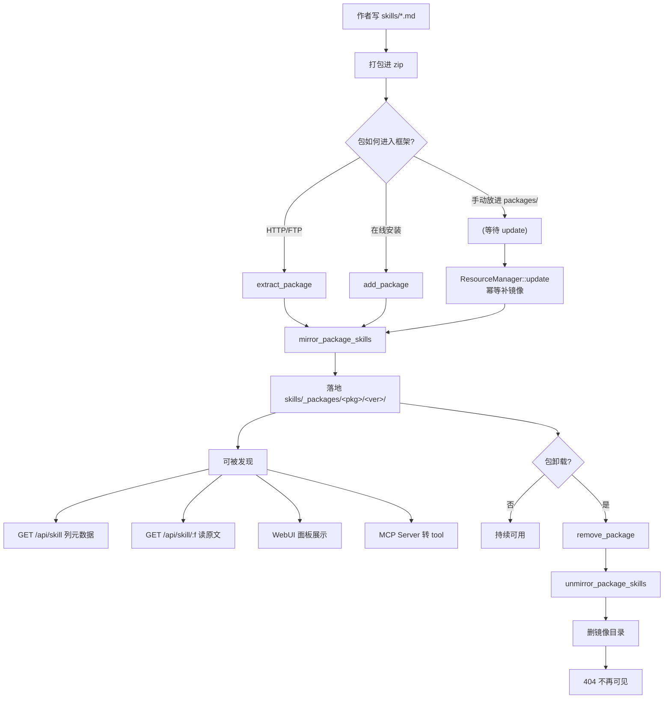

---

## 写一个 Skill 文件

包作者只需在 zip 根的 `skills/` 下放 markdown 文件即可。框架不规定具体内容格式，但两种主流写法都能被正确提取标题。

**写法一：纯标题**

```markdown
# 移动能力使用指南

本能力支持把机器人移动到指定坐标。先调用 ...
```

**写法二：带 frontmatter**（用三个等号围栏替代 yaml 分隔符示例）

```text
name: move_skill
title: 直线移动任务
---
# 直线移动任务

通过 POST /api/instance 创建实例，参数 velocity 单位 m/s ...
```

两种写法 `extract_skill_title` 都会抓到标题（写法二优先用 frontmatter 的 `title:`）。建议至少给每个 skill 一个清晰的标题和"如何调用"段落，方便 Agent 理解。

相关参考：

- [模块文档总览](/guide/concepts/architecture)
- [资源管理器](/guide/concepts/architecture)
- [HTTP API 参考](/api/http-api)
- [消息总线](/guide/concepts/architecture)
- [目录结构](/guide/concepts/architecture)
